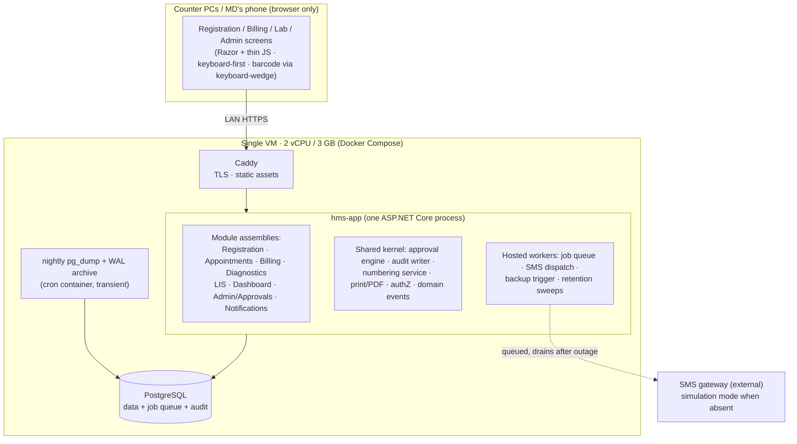

# 00 — Architecture Overview

- **Status:** Draft for PM review · **Date:** 2026-07-26 · **Spec:** `docs/specs/0003-mvp-architecture/`
- **Scope:** the 8 MVP modules of PRD §9A.2, on the mandated 2 vCPU / 3 GB single-VM budget, designed so the excluded modules (IPD folio, OT, pharmacy, accounts, payouts…) plug in later without migration pain (constraint C2).

This document is the prose summary. Every decision it states is recorded (with options and reversal triggers) in `01-adr/`; this file cites the ADR rather than re-arguing it.

---

## 1. The design problem in one paragraph

A Bangladeshi private hospital's counters must keep registering, billing and running the lab through internet outages and power cuts, operated by non-technical 30–55-year-old staff on a keyboard, while every taka stays attributable, auditable and reproducible — all initially on a single small VM that also has to carry a flawless offline sales demo, and later grow to a 150-operator, multi-branch deployment without being rebuilt. The architecture therefore optimises for: **few moving parts, strong data integrity in the database itself, LAN-first operation, and module boundaries that are enforced now and split later.**

## 2. Stack (ADR-0001, ADR-0002, ADR-0003)

| Layer | Choice | Why (one line each) |
|---|---|---|
| Runtime | **.NET (current LTS at build start; .NET 10 LTS as of this writing)** on Linux containers | Industry-standard, enterprise ecosystem, first-class macOS dev (Apple Silicon native), long support windows — per PM steer that production hardware will be far larger than the MVP box |
| Web framework | **ASP.NET Core**, server-rendered **Razor** pages + a thin vanilla-JS layer (type-ahead, barcode capture, F-key map, toasts) | Low client and server RAM, works on 1366×768 counter PCs, zero CDN on the critical path (demo edge case 1), fits the Altushi design's interaction grammar |
| Application shape | **Modular monolith** — one ASP.NET Core host, one project/assembly per module, communication only via internal contracts + in-process domain events | The 3 GB budget forbids services now; the enforced seams are the later split lines (§7 below) |
| Database | **PostgreSQL** (single instance) | The only stateful service on the box; also carries the job queue (`SKIP LOCKED`), type-ahead search (trigram indexes), and the append-only audit store — no Redis, no search engine, no broker (each would cost RAM we don't have; ADR-0002 records the maths) |
| ORM / migrations | **EF Core + Npgsql**, EF migrations, plus hand-written SQL for the money-critical paths (constraints, counters, day-close aggregation) | Integrity rules live in the schema, not only in C# — triggers/constraints keep C5/C6 true even against future code bugs |
| Background work | .NET hosted workers inside the app process, polling a Postgres job table (`FOR UPDATE SKIP LOCKED`) | SMS dispatch, report-ready events, nightly backup trigger — no extra container |
| Reverse proxy | **Caddy** (small static binary; internal CA for LAN TLS) | TLS + static assets + gzip for ~50 MB (estimate); nginx is the recorded fallback (ADR-0005) |
| PDF / print | Shared HTML print views (browser print pipeline) for counter printing; server-side PDF renderer for archival copies and the no-printer fallback — engine choice and the **Bangla text-shaping spike** are ADR-0009 | Pixel fidelity (N8) is proven by golden-file tests per layout |
| Auth | ASP.NET Core Identity (cookie sessions), server-side enforcement of the §12 matrix, idle-lock + optional TOTP 2FA for finance roles | ADR-0019 (Q15) |

**Explicitly rejected on this box** (ADR-0002/0003): microservices, Kubernetes, Redis, RabbitMQ/Kafka, Elasticsearch, a separate SPA front-end with its own node runtime, headless-Chromium-per-request PDF. Each rejection is reversible on bigger hardware — none is baked into the code.

## 3. Component picture

Everything a counter needs is on the LAN. The internet is only on the path of outbound SMS (queued) and remote support — never on the path of registration, billing or lab work (C8, ADR-0006).

## 4. How the PRD §6 integration spine is realised

PRD §6.1 defines two spines: the **patient folio** and **day-close → ledger**. In the MVP:

1. **Charge capture is one shared write path.** Every billable event — OPD service, diagnostic test line — is a `charge_line` created by the owning module through the Billing module's contract. In the MVP, charge lines attach to an **encounter** and are invoiced immediately (outdoor flow). The folio (post-MVP) is *the same table shape* with a different parent: an admission-scoped folio instead of a same-day encounter. This is the C2 seam — IPD posting later means adding a parent type, not re-plumbing billing (details: `02-domain-model.md` §3).
2. **The order→billing join that wins the demo** (§9A.2): a test order raised anywhere creates unbilled charge lines; the billing counter sees them appear in-session (server push over SSE with polling fallback) and turns them into an invoice without retyping. Payment flips the order to "paid", which releases barcode label printing and the LIS worklist entry — one transaction, no dual entry.
3. **Day-close is the only door to accounting.** Modules never write ledger rows. Closing a counter session computes expected-vs-counted cash, records variance, locks the session's receipts (C6), and posts an immutable **day-close summary** row. The future Accounts module consumes summaries from this holding structure (§9A.3); the MD dashboard reads the same rows today — so when M15 arrives, the dashboard's numbers don't change, and no historical rewrite is needed (PRD §6.6 audit boundary; `04-api-and-module-boundaries.md`).
4. **Approvals are one engine** (C7): discount, refund, bill edit/reset, day-reopen, post-lock posting all raise typed `approval_request` rows routed by the §12 workflow table; modules subscribe to the decision event. No module implements its own approval state machine.

## 5. Money integrity, in the database

- **No hard deletes** (C5): financial tables have no `DELETE` grants for the app role; corrections are reversal rows. Append-only `audit_event` (actor, action, entity, before/after) written in the same transaction as the change.
- **Effective-dated prices** (C6): rate plans are versioned rows `[valid_from, valid_to)`; an invoice line stores the *resolved* price and the rate-version id, so historical invoices reproduce themselves even if the catalog changes (edge cases 13, and DoD "effective-dated prices proven").
- **Gap-free numbering** (edge 15): invoice/receipt/UHID numbers come from per-scope counter *rows* incremented under row lock inside the creating transaction — collision-free under concurrency, gap-free because the number is issued only on commit-bound paths, fiscal-year reset driven by a configured (not hardcoded) fiscal calendar (ADR-0004).
- **Whole-taka rounding** (edge 30): one rule — line amounts are integers; percentage discounts and any future VAT round **half-up to whole taka at the invoice-total step, once**; payments, dues and day-close reconcile by construction because they only ever see the rounded totals (`03-data-model.md` §6).
- **Concurrency** (C9, ADR-0015): uniqueness by constraint (one serial number per doctor/day, one open session per counter), `SELECT … FOR UPDATE` on hot rows (due balance, counters), optimistic version checks on user-edited documents with a user-comprehensible "someone else changed this" outcome (edge 28) — never a silent overwrite.

## 6. Offline, outage and demo posture (ADR-0006)

- **LAN-first:** the server lives in the hospital (or on the presenter's laptop). An internet outage changes nothing at the counters. This is the honest, low-complexity reading of PRD §8 N2 — we do **not** attempt browser-local offline replicas in the MVP (scoped out with reasoning in ADR-0006; what does *not* work offline: outbound SMS — queued and drained — and remote support).
- **Power cut** (edge 7): Postgres WAL guarantees committed-transaction durability; compose `restart: unless-stopped` + healthchecks bring the stack back inside ~2 minutes; numbering design makes duplicate invoices impossible on recovery. A small UPS for the server is a deployment recommendation, recorded as such (estimate, not requirement).
- **Demo:** identical compose file runs on the laptop (macOS dev parity is a standing requirement); every asset self-hosted (fonts included — the Bangla font ships in the image); printer-less runs fall back to on-screen PDF previews that are the same layouts (edge 2); SMS runs in visible simulation mode (edge 3); multi-instance demos are separate compose projects with distinct ports/volumes (edge 6); one-command reset restores a known-good seeded database (edge 5, `07-demo-kit.md`).

## 7. How the excluded modules plug in later (C2)

| Future module | The seam that already exists in the MVP |
|---|---|
| IPD / patient folio (M6) | `charge_line` gains a folio parent; bed entity and its state machine are modelled now (data only, minimal UI); folio lock/settlement states defined in `02-domain-model.md` so billing code is written against them from day one |
| OT (M7) | Posts charge lines + consumables through the same charge contract; schedule entity is an extension, no core change |
| Pharmacy (M11) | A new module assembly with batch/expiry stock; sells through the same invoice/payment/day-close spine; FEFO logic is module-internal |
| Accounts (M15) | Consumes the day-close summary holding structure that MVP already writes; chart-of-accounts mapping happens then, historical summaries replay cleanly |
| Consultant/referral payouts (M17/M19) | Every invoice line already records doctor and referrer attribution — accrual computation later is a read-side job over data captured from day one |
| Multi-branch (Q3) | Every business row carries `branch_id` (single value in MVP); consolidated dashboards become a query, not a migration (ADR-0007) |
| Analyzers/DICOM (Q4) | Device I/O isolated behind a local connector-agent contract; adding an analyzer model is a connector drop-in, not a product release (ADR-0008) |
| Licensing (Q12) | Module entitlement flags gate nav + endpoints from day one — the MVP itself ships as "8 modules enabled" (ADR-0016) |

## 8. Budget reality (summary — full table in `06-deployment.md`)

Steady-state limits total **~1.9 GB of the 2.6 GB allowance** (container limits + host baseline), leaving **≥ ~700 MB headroom** above the 400 MB floor, no swap in steady state — `06-deployment.md` §2 is the single source of truth for these figures. All figures are **estimates until measured** (tracked in spec 0003 notes; the DoD requires validation against real container usage before the demo). The honest capacity ceiling of this box is estimated at **~25–40 concurrent operators** for the golden-thread workload at ≤ 1 s perceived billing latency — *not* the §14 design ceiling of 150, which requires the scale-up path (bigger VM → separated DB host) described with explicit metric triggers in `06-deployment.md` §5. Scale-up requires **no re-architecture**: same images, same schema, more resources.

## 9. Frontend direction

The UI implements the user-approved **Altushi HMS design reference** (`assets/altushi-hms-demo.html`): grouped sidebar with department colour accents, role-filtered navigation, KPI tiles, one reusable register/list template, POS-style billing (catalogue left / cart right, F2/F3/F9/F10), kanban LIS pipeline advanced by barcode scan, single letterhead system for every printable, status footer with server/counter/shortcut context. `05-ui-architecture.md` maps this design to PRD §7's fifteen binding principles and the ~25 high-frequency screens.

## 10. Reading order for review

1. This overview → 2. `01-adr/` (the decisions, esp. ADR-0001/0002/0006/0015) → 3. `02`/`03` (model) → 4. `06-deployment.md` (budget table) → 5. the rest.
