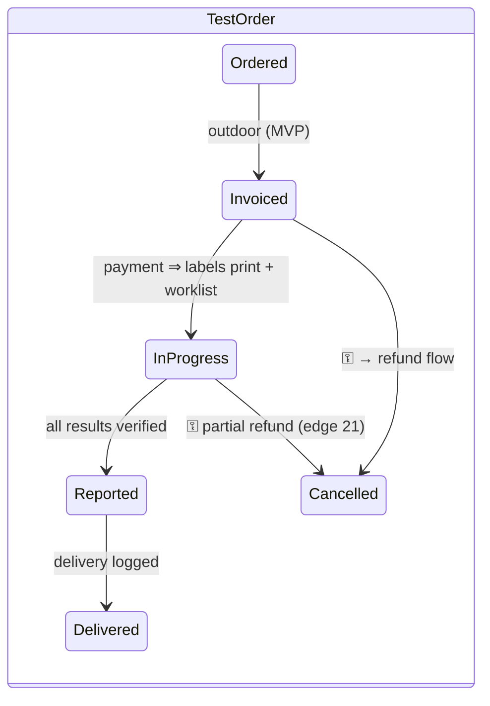

# 02 — Domain Model

- **Status:** Draft for PM review · **Date:** 2026-07-26 · **Spec:** `docs/specs/0003-mvp-architecture/`
- Derived from PRD §10 (entities & ownership) and §11 (workflow states). MVP entities are modelled fully; post-MVP entities appear only where C2 demands their *seams* exist now. Concrete tables/indexes live in `03-data-model.md`.

## 1. Module ownership map (MVP)

| Module (assembly) | Owns | Posts into |
|---|---|---|
| Registration (M1) | Patient, PatientMerge | — |
| Appointments (M3) | DoctorSchedule, Appointment/Serial | Encounter (via Billing contract) |
| Billing (M4) | Encounter, Invoice, ChargeLine, Payment/Receipt, Due, CounterSession, DayClose | day-close summary (holding structure) |
| Diagnostics (M8) | TestOrder, OrderDelivery log | ChargeLine (via Billing contract) |
| LIS (M9) | Sample, Result/Report, Verification | TestOrder status |
| Dashboard (M22) | read-models only | — |
| Admin (M21) | RatePlan, Catalog, Bed (master), Users/Roles, ApprovalRequest, AuditEvent, ImportBatch, Settings, Entitlements | — |
| Notifications (M20) | SmsMessage, Template | — |

Cross-module writes only via owner contracts (ADR-0003). Doctor/Consultant and Referrer masters sit in Admin for MVP and migrate to M17/M19 ownership later without schema change (§10 note: M17/M21 shared authorship).

## 2. Core entities and lifecycles

### 2.1 Patient (M1)

Permanent identity: UHID (ADR-0004), name, sex, DOB **or** age (§7 U13; see 2.2), phone (nullable — edge 24), guardian, area/address, optional NID, flags, `provisional` (edge 11). Never deleted; deactivate/merge only.

- **Unknown/unconscious emergency patient (edge 25):** registration with placeholder identity (`UNKNOWN` flag, sex if known, estimated age band). UHID and billing proceed normally; identity completed later via ordinary edit (audited). No special billing path — the *patient record* is provisional, the money is real.
- **No phone (edge 24):** phone is optional; SMS-dependent flows skip with a visible "no mobile on record" note; nothing blocks registration or billing.
- **Duplicate merge (edge 23):** `PatientMerge(survivor, merged)` re-points visits/invoices/orders/results to the survivor, stamps the merged record `MergedInto`, keeps both histories readable, and is Tier-1 audited. Merge is approval-gated (supervisor) and reversible only by a compensating merge record — no row deletion. Duplicate *warning* at entry: phonetic + phone match at save time (§9A.2 module 1).

### 2.2 Age ⇄ DOB (edge 26)

Store `dob date NULL`, `age_years/months smallint NULL`, `age_estimated bool`, plus `age_as_of date`. Either direction accepted; both never diverge (DOB wins when present; age derived at display). Lab reference-range resolution uses **age at sample-collection time** computed from DOB when exact, else the recorded estimate — precision class is carried to the result so ranges flagged from estimated ages are marked on the report.

### 2.3 Encounter & charge spine (M4) — the C2 seam

```
Encounter (OPD/ER visit, same-day)          ← MVP parent
  └─ ChargeLine (service, qty, resolved price, rate-version ref,
                 doctor attribution, referrer attribution, source module)
       └─ Invoice → Payment/Receipt → Due

Admission → PatientFolio                     ← post-MVP parent (M6)
  └─ ChargeLine (same shape, folio-scoped, poster module recorded)
```

`ChargeLine.parent` is polymorphic by design (`encounter_id` now, `folio_id` later — modelled as separate nullable FKs with an XOR check). IPD arrives by adding the folio parent and its lifecycle; billing, pricing, audit and payout attribution code paths are untouched. This is the retrofit-pain insurance demanded by C2, in one sentence: **outdoor billing is already folio-shaped, with a one-day folio.**

Folio lifecycle (defined now, built with M6): `Open → accumulating → Blocked(service-hold) → Settlement Draft → Locked`; post-lock posting requires approval (⚿, §11). The **Blocked/due-hold** state and its release are approval transitions — reflected in the Admission machine below.

### 2.4 Invoice, payment, due (M4)

States (§11): `Draft → Billed → Partially Paid → Paid`; exits `Cancelled⚿` (pre-payment) and `Refunded⚿` (post-payment, partial/full). Invariants:

- An invoice stores **resolved** prices + rate-version refs (C6) — recomputation never changes a stored document.
- Payments are immutable once their counter session day-closes (§10). Refund after day-close (edge 20): a refund never mutates the original receipt or the closed session; it is a **new negative-value receipt in the current open session**, linked to the original, approval-gated (§12 workflow). Closed sessions stay closed; today's session carries today's money movements.
- Due is a live balance derived from invoice vs. payments, guarded by row lock on collection (ADR-0015). Due collection creates receipts against the original invoice from any later session.

### 2.5 Bill request workflow (M21 engine; §5A-21, §11)

`Edit / Reset / Refund / Special-Discount` requests: `Raised(operator, reason) → Pending(per-type approver queue) → Approved⚿/Rejected → applied`. **Reset** voids the bill (reversal, number retained in audit) and opens controlled re-entry. Discount requests auto-approve under the requester's role threshold (thresholds are data). The approval engine is generic: `ApprovalRequest(type, source doc, requester, reason, decision, decider, timestamps)` — one machine for all five MVP types (C7), delegation/escalation below.

**Approver absent (edge 19):** per-approval-type policy holds an ordered approver chain + escalation timeout (e.g., Billing Supervisor 10 min → Accounts Manager → MD) and supports standing **delegation windows** (night shift, leave). A request never dead-ends at the counter; the pending queue is visible on approver dashboards and (post-MVP) MD's phone. Defaults are a PM policy question (`09-questions-for-pm.md`).

### 2.6 Counter session & day-close (M4)

States (§11): `Opened → Active → Day-Close Pending → Closed(variance logged) → Reopened⚿`.

- One open session per counter (partial unique constraint). Session binds operator, counter, opening float.
- **Close:** expected cash computed from receipts by tender; operator enters counted cash; variance recorded **not blocked** (edge 18); session locks its receipts; an immutable `DayCloseSummary` posts to the ledger **holding structure** (§9A.3, §6.6) — department splits, tender totals, discounts, dues, variance.
- **Forgot to close (edge 17):** next open attempt on a counter with a stale session forces a **supervised carry-close**: the old session closes against the old business day (variance recorded, supervisor approval ⚿), then a fresh session opens for today. Two days can never silently merge; the business-day attribution rule is ADR-0004's.
- **Reopen** is approval-gated and creates a reopen audit episode; post-reopen receipts append to the same day's summary as a superseding version (both retained).

### 2.7 Appointment/Serial (M3)

`Booked → Confirmed → Arrived → In-Chamber → Done`; exits `Cancelled(reason) · Postponed→Booked · Transferred · No-Show` (§11). Serial uniqueness per doctor/day by constraint (ADR-0015). Queue view is a read-model of today's serials.

### 2.8 Test order → sample → result (M8/M9) — the golden-thread seam



- Order carries referrer + ordering doctor (payout attribution from day one, ADR-0017) and a TAT-based **promise time** per test (delivery commitment, §9A.2).
- **Sample ↔ test multiplicity (edge 33):** `Sample` and `OrderTest` are distinct entities joined M:N (`sample_test`). One CBC+ESR tube = one sample, two tests; one culture order = many samples, one test. Every sample has exactly one barcode; every test knows its sample set. Duplicate barcodes are impossible (identity lives on Sample alone); a lost label **reprints the same barcode** (edge 27) with a reprint audit event.
- Sample states (§11): `Pending Collection → Collected → Received → (Rejected(reason) → Re-collection child → Collected…) → Resulted → Verified → Report Ready → Delivered`. A rejection spawns a child sample (new barcode) linked to the same tests — chain preserved, no orphaned results.
- **Cancel after collection (edge 21):** cancellation from `InProgress` is approval-gated, computes the refundable subset per business policy (PM default question), records a **sample disposal** event for collected material, and routes money through the standard refund flow.
- Results: parameter values + flags (H/L auto against reference range chosen by age/sex — 2.2) or narrative. `Entered → Verified(e-sign) → Amended⚿(v2+, all versions retained)`.
- **Verification identity (edge 34):** verifier is a first-class signatory — treating doctor, staff pathologist, or an external **reporting consultant** (§5A-R1): stored identity, credentials line, e-sign hash and (optional) signature image on the report. The printed report names who verified, always.
- **Amended after delivery (edge 22):** amendment creates v2 keeping v1 immutable; the delivery log marks *which version left the building*; re-issue prints "AMENDED — supersedes report of <date>" and logs a new delivery. Both versions retrievable forever (N10).
- **Delivery:** report-ready fires the notification event (SMS, simulated when no gateway — edge 3); delivery log records collector identity/time (delivery slip barcode).

### 2.9 Rate plans & catalog (M21)

`RatePlan` versions per service/test: `[valid_from, valid_to)`, author, approval ref (rate changes are MD-approved per §12). Overlap prevented by exclusion constraint. Corporate/package variants are additional plan scopes resolved by precedence at billing time; the invoice stores what it resolved (C6, edge 13). `TestCatalogItem`: name, department, sample type(s), TAT, template/parameters, reference ranges (age/sex banded), `provisional` flag (edge 11). Bulk import per ADR-0010 (edge 12).

### 2.10 Bed (master now, lifecycle later — edge 14)

Bed/cabin inventory is creatable in MVP (ward, class, tariff ref) with status `Not-yet-available / Out-of-Service / Free` — beds exist on a drawing before physically (edge 14). The full §11 cycle (`Free → Reserved → Occupied → Cleaning → Free`) activates with M6; the entity, tariff link and status enum are fixed now so construction-phase data entry is never thrown away.

### 2.11 Notifications (M20)

Event-driven: registration, report-ready (+ appointment confirm). `SmsMessage: Queued → Sent → Delivered/Failed(→Retried)` via the jobs table; **simulation mode** renders the exact message on-screen/log with "SIMULATED" stamp (edge 3). Templates support Bangla bodies with live segment count (ADR-0014). Log permanent (§10).

### 2.12 Audit & approvals (M21)

Per ADR-0011 (tiers, in-transaction) and 2.5 above. `AuditEvent` and `ApprovalRequest` are kernel entities every module writes through contracts.

## 3. Post-MVP seams checklist (C2 — what exists in the MVP schema *for* modules we are not building)

| Future need | Present now as |
|---|---|
| IPD folio (M6) | `ChargeLine.folio_id` (XOR with encounter), folio + admission state enums defined, Bed master + tariff ref |
| Admission machine incl. **Blocked(due-hold)⚿ ⇄ Released⚿**, Death, Absconded (§11, §5A-R4) | State enum + transition table reserved; due-hold interacts with the existing Due entity |
| OT (M7) | Charge posting contract; OTCase entity deferred entirely (no seam cost) |
| Pharmacy (M11) | Invoice/tender/day-close spine reused; batch/expiry entities deferred |
| Consultant accruals (M17) | doctor attribution on every ChargeLine + `bank_account` entity (ADR-0017) |
| Referral credits (M19) | referrer attribution on TestOrder/ChargeLine; Referrer master with access restriction (§8 N5) |
| Corporate/panel (M18) | `patient_type` + corporate tag on invoice; corporate rate-plan scope in 2.9 |
| Accounts (M15) | DayCloseSummary holding structure (§6.6); tax columns dormant (ADR-0018) |
| Multi-branch | `branch_id` everywhere (ADR-0007) |

## 4. Domain events (in-process, kernel bus)

`PatientRegistered · TestOrderPaid (→ labels + worklist) · ResultVerified (→ report-ready notification) · ReportDelivered · DiscountDecided · SessionClosed (→ dashboard refresh) · ApprovalRequested/Decided · RateChanged`. Events are transactional-outbox rows (same DB), so a crash cannot lose a side effect between modules (edge 7 discipline).
