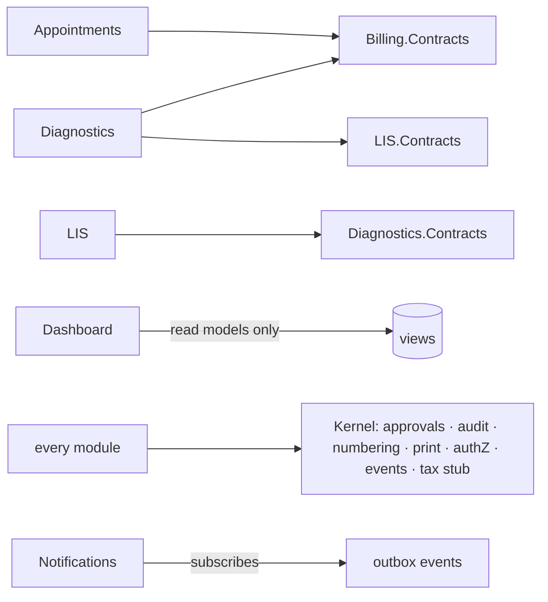

# 04 — API & Module Boundaries

- **Status:** Draft for PM review · **Date:** 2026-07-26 · **Spec:** `docs/specs/0003-mvp-architecture/`
- Companion to ADR-0003 (modular monolith). This file fixes the *contracts*: who may call whom, for what, and the two shared engines everything routes through.

## 1. Boundary rules (enforced in CI)

1. A module exposes a **Contracts** interface assembly (DTOs + service interfaces) and keeps everything else `internal`.
2. Allowed dependencies (arrows = "may call"):



   No module references `reg.patient` tables directly except Registration; others use `Registration.Contracts.IPatientLookup` (id, UHID, banner data). Dashboard references nobody's internals — only the read-model views (`03 §10`).
3. Cross-module **writes** are contract calls in the caller's transaction (same DB — atomicity is free); cross-module **notifications** are outbox events (at-least-once, idempotent handlers).

## 2. The two shared engines

### 2.1 Approval engine (C7 — the only approval mechanism in the product)

Kernel service consumed by every module:

```
IApprovalEngine.Raise(type, sourceRef, requester, reason, amount?) → RequestId | AutoApproved
IApprovalEngine.Decide(requestId, decision, decider, note)
events: ApprovalRequested, ApprovalDecided
```

- Routing/thresholds/delegation/escalation are **data** (`kernel.approval_policy/_delegation`, §12 workflow table). Modules never encode approver logic.
- Auto-approval under threshold returns synchronously (billing UX stays fast, §8 N1); above threshold, the source document sits in its `Pending` state and the approver inbox (a kernel-owned screen surfaced per role, §7 U1) works the queue.
- MVP consumers: discount, refund, bill edit/reset, session reopen, carry-close, rate change, patient merge. Later modules (PO, vouchers, payouts) plug into the same table — no new engine.

### 2.2 Notification dispatch

Modules never send SMS. They emit domain events; Notifications maps events → templates → `notif.sms` rows → gateway job (or **simulation**: the message renders in the demo tray with a SIMULATED stamp — edge 3). Adding a channel (email, portal push — Q8) touches only this module.

## 3. Charge posting & the day-close boundary (§6.6)

The audit boundary in one rule: **only Billing writes money rows; only DayClose writes to the ledger holding structure; nobody writes ledger entries.**

```
Diagnostics → IChargePoster.PostCharges(encounterRef, lines[])   # unbilled charge lines
Billing UI  → invoice creation freezes lines, resolves rates (03 §5), issues number (ADR-0004)
Payment     → IReceipts.Collect(invoiceId, tender, amount)        # row-locks due
SessionClose→ builds DayCloseSummary (immutable, versioned)
Future M15  → reads day_close_summary; posts real ledger vouchers in its own domain
```

A future module that "needs" to write a receipt or a summary row directly is by definition mis-designed — it must post charges or raise approvals like everyone else. This is the competitor failure mode (§2.4) we are structurally excluding.

## 4. HTTP surface

- **Operator UI:** server-rendered Razor routes per module (`/billing/...`, `/lis/...`), anti-forgery on, session cookies (ADR-0019). Progressive-enhancement endpoints (type-ahead JSON, SSE updates) live under the same module route and the same authZ policies — there is no separate "API app".
- **SSE channels:** `counter:{id}` (new unbilled charges appear at billing — the demo seam), `lis:worklist`, `approvals:{role}`, `dashboard`. Polling fallback at 5 s for resilience.
- **Machine APIs (versioned, token-authenticated):** `/api/device/v1/*` (ADR-0008, dormant in MVP), `/api/export/v1/*` (customer data export, ADR-0013), future portal/consolidation feeds (ADR-0007/0012). These are the only JSON APIs promised stability.
- **Idempotency:** all money POSTs accept an idempotency key (client-generated per submission) — double-submit from a laggy counter click cannot double-charge (§8 N4 at the HTTP layer; complements ADR-0015).

## 5. AuthZ enforcement points

Policy = `module.action` (+ scope), evaluated server-side per request (ADR-0019); nav composition, endpoint attribute, and background-job scheduler all consume the same policy service (ADR-0016's three choke points). §12's matrix is seeded as role templates; per-facility customisation edits data, not code.

## 6. Error & outage semantics at the boundary

- Contract calls are in-process: failures are exceptions inside one transaction — no partial cross-module state (edge 7).
- Outbox handlers are idempotent and retried with backoff (jobs table); poison messages park with an admin alert.
- SSE loss degrades to polling silently; printing failures surface the on-screen PDF fallback path (edge 2) rather than an error dead-end (§7 U7 tone: the system offers the next action, not a stack trace).
