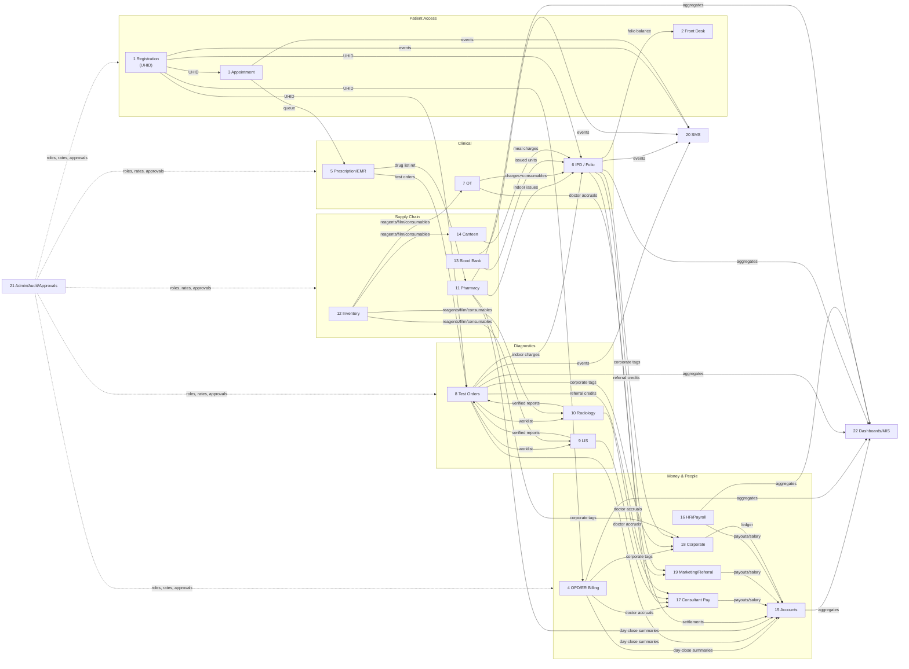
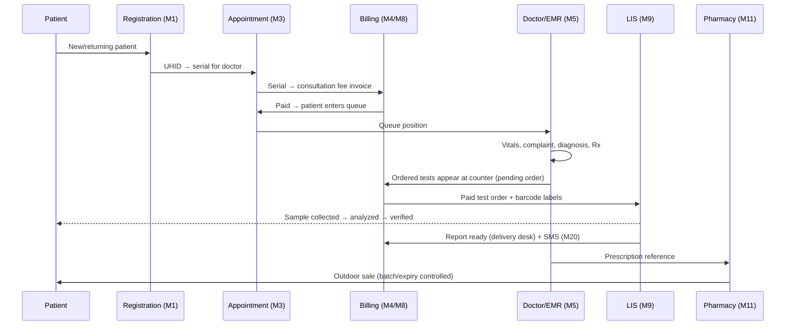
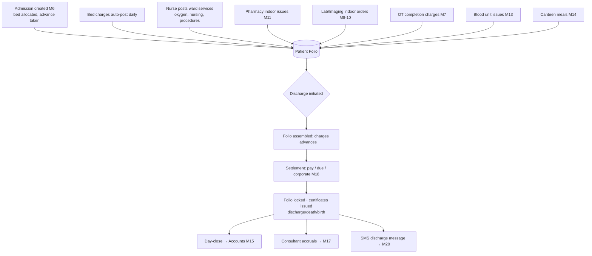

# Product Requirements Document (PRD)
## Hospital Management System ERP — Bangladesh Market

| | |
|---|---|
| **Document** | Product Requirements Document (Architect Handoff Edition) |
| **Prepared by** | ERP Project Manager (20 yrs, Hospital ERP domain) |
| **Audience** | Principal Software Architect & Engineering Design Team |
| **Date** | 26 July 2026 |
| **Status** | Draft v1.2 — v1.1 enriched with live-system walkthrough of both competitor products; v1.2 adds R5 Nursing Station |
| **Scope discipline** | This document contains **business requirements only**. All technology decisions (stack, database, architecture style, deployment) are explicitly delegated to the Software Architect — see §16 Handoff Checklist. |

**Changelog**
- **v1.2 (03 Aug 2026)** — Added §5A.2 **R5 Nursing Station** (ward nursing console: ward monitor, prescription-driven Medicine Chart schedule with overdue visibility, attributable care tasks, ward duty assignment — fills M6's duty-assignment `[S]` item and the 2026-08 audit's missed-dose visibility gap). Added US5.5, US6.5, US6.6.
- **v1.1 (26 Jul 2026)** — Added §2.4 live-system walkthrough findings from authenticated access to **MEDISpa** (full menu + form crawl) and structural extraction of **PrimeMIS** (complete Angular route/API map). Added §3.4 Bangladesh financial rails (BEFTN/TDS/VAT). Added §5A live-observed module enrichments (46 verified additions across modules + 4 new sub-modules). Extended §11 state machines, §12/§16. Every added item is source-tagged `[obs: MEDISpa]` / `[obs: PrimeMIS]`.
- **v1.0 (26 Jul 2026)** — Initial PRD from the two written vendor proposals + Bangladesh industry research.

---

## Table of Contents

1. [Executive Summary & Product Vision](#1-executive-summary--product-vision)
2. [Analysis of Reference Proposals](#2-analysis-of-reference-proposals) · [2.4 Live System Walkthrough](#24-live-system-walkthrough--observed-findings-v11)
3. [Bangladesh Industry Context](#3-bangladesh-industry-context)
4. [User Personas](#4-user-personas)
5. [Module Breakdown & User Stories](#5-module-breakdown--user-stories) · [5A Live-Observed Enrichments](#5a-live-observed-module-enrichments-v11)
6. [Module-to-Module Data Flow](#6-module-to-module-data-flow)
7. [UI/UX Requirements for 30+ Aged Operators](#7-uiux-requirements-for-30-aged-operators)
8. [Non-Functional Expectations](#8-non-functional-expectations-business-language)
9. [Phased Release Plan](#9-phased-release-plan)
10. [Business Data Dictionary](#10-business-data-dictionary-key-entities--ownership)
11. [Workflow State Definitions](#11-workflow-state-definitions)
12. [Roles & Permission Matrix](#12-roles--permission-matrix)
13. [Integration & Hardware Inventory](#13-integration--hardware-inventory)
14. [Volumetrics & Scale Assumptions](#14-volumetrics--scale-assumptions)
15. [Success Metrics](#15-success-metrics)
16. [Assumptions, Open Questions & Architect Handoff Checklist](#16-assumptions-open-questions--architect-handoff-checklist)
17. [References](#17-references)

---

## 1. Executive Summary & Product Vision

### 1.1 What we are building

A **complete Hospital Management System (HMS) ERP product** — our own commercial product, not a bespoke build — targeting **private hospitals, clinics, and diagnostic centers in Bangladesh** in the 50–300 bed range. The product covers the entire hospital operation: from patient registration at the front desk to discharge, from lab sample to verified report, from medicine purchase to sale, and from every taka billed to the general ledger.

The product competes directly with locally established offerings such as **MEDISpa ERP (Impose Tech BD Ltd.)** and **PrimeMIS (Farazy MaxIT)** — both of which quoted Sylhet Evergreen Hospital in late 2025 (BDT 6,00,000 and BDT 5,00,000 respectively, plus BDT 10–12k/month maintenance). Their proposals define the *baseline feature expectations* of this market. Our product must meet that baseline as table stakes and win on **operator experience, workflow integrity, and management insight**.

### 1.2 Product vision statement

> *"Every taka, every patient, every sample — tracked in one system that a 45-year-old front-desk operator can master in two days."*

### 1.3 Why we will win (product differentiators, not technical claims)

| # | Differentiator | Rationale from competitor analysis |
|---|---|---|
| D1 | **Operator-first UX** designed for 30+ aged, non-technical staff | Both competitors list features exhaustively but sell "user friendly" as a slogan. Neither proposal shows evidence of role-tailored screens, guided workflows, or error-proofing. |
| D2 | **Single integrated billing spine** — one patient, one folio, all charges (OPD, IPD, lab, pharmacy, OT, canteen) converge into one bill with full audit | Competitors bolt modules together; billing leakage between modules is the #1 revenue complaint in this market. |
| D3 | **Approval-workflow discipline** — discounts, refunds, bill modifications, purchases, and vouchers all pass through request→approve chains | MEDISpa markets "Request Base Bill Modifications" as an exclusive; we make controlled approvals universal. |
| D4 | **Referral & marketing economics as a first-class module** | PrimeMIS treats doctor referral ledgers seriously (territory-wise, marketing-executive-wise); MEDISpa barely covers it. This is a decisive purchase driver for Bangladeshi diagnostic-led hospitals. |
| D5 | **Management visibility** — real-time income, due, discount, and department dashboards for the Managing Director | Both competitors offer dashboards; ours must answer the MD's daily question — "how much money came in today, who gave discounts, and who owes us" — on one screen. |

### 1.4 Target customer profile

| Attribute | Value |
|---|---|
| Facility type | Private hospital, clinic, diagnostic center, or combined hospital+diagnostic |
| Size | 50–300 beds; 10–60 consultant doctors; 30–150 staff |
| Location | District and divisional cities of Bangladesh (Sylhet, Chattogram, Rajshahi, Khulna, Dhaka periphery) |
| Buyer | Managing Director / owner-doctor; influenced by accounts manager and senior consultants |
| Operators | 30+ years old, non-technical staff; Bangla-speaking but comfortable operating an **English-language UI** (market norm — both reference products ship English UIs) |
| Payment reality | Cash-dominant with rising bKash/Nagad/card usage; heavy due (credit) and discount culture; corporate/panel patients |

### 1.5 Out of scope for this product version

- Government hospital workflows (procurement rules, DGHS staffing hierarchies)
- Telemedicine / video consultation
- Health insurance claim adjudication (insurance penetration in Bangladesh is minimal; a placeholder exists in billing for "corporate/panel" payers which covers today's reality)
- Bangla-language UI (English-only per product decision; Bangla appears only in SMS templates if a customer demands it — flagged as an open question, §16)

---

## 2. Analysis of Reference Proposals

Two vendor proposals to Sylhet Evergreen Hospital were analyzed in depth. They represent the current market baseline.

### 2.1 Proposal summary

| | **MEDISpa ERP** (Impose Tech BD Ltd.) | **PrimeMIS** (Farazy MaxIT) |
|---|---|---|
| Date | Nov 03, 2025 | Oct 26, 2025 |
| One-time price | BDT 6,00,000 | BDT 5,00,000 |
| Monthly charge | BDT 10,000 | BDT 12,000 |
| Modules listed | 18 | 23 |
| Delivery | ~35 days + 30 days onsite training | Within 3 months |
| Source code | **Not included** | Not stated (implied not included) |
| Notable terms | Client gets **no database access**; 40/30/30 payment | 50/50 payment; hardware excluded |

*(Both vendors describe their internal technology stacks in the proposals; those are vendor implementation details and deliberately excluded from this PRD — our architect makes our technology decisions.)*

### 2.2 Module coverage comparison

| Capability | MEDISpa | PrimeMIS | Our product |
|---|:---:|:---:|:---:|
| Patient registration & ID card (barcode, photo, fingerprint) | ✅ (photo + fingerprint) | ✅ (barcode card) | ✅ adopt superset |
| Front desk / help desk enquiry | ✅ | ➖ (partial via dashboards) | ✅ |
| Appointment scheduling | ✅ (full lifecycle) | ✅ (dashboard-centric) | ✅ adopt superset |
| Prescription / EMR | ✅ | ✅ | ✅ |
| OPD & Emergency billing | ✅ | ✅ (separate Emergency module) | ✅ |
| IPD management | ✅ | ✅ (adds nurse-call, ICU/CCU/HDU/NICU) | ✅ adopt superset |
| **OT Management** | ❌ **gap** | ✅ (full: schedule, team, consumables, billing) | ✅ from PrimeMIS |
| Diagnostics/test order billing | ✅ | ✅ (adds territory & marketing-exec sales views) | ✅ adopt superset |
| LIS (analyzer-connected lab) | ✅ (incl. QC management) | ✅ (adds full process tracking) | ✅ adopt superset |
| Radiology reporting | ✅ (report mgmt) | ✅ (templates, e-signature, DICOM viewer) | ✅ from PrimeMIS |
| PACS / DICOM worklist | ✅ (dedicated modules) | ✅ (integration listed) | ✅ |
| Pharmacy (indoor+outdoor) | ✅ (generic-name option, ROL auto shortlist) | ✅ (adds pharmacy dashboard) | ✅ adopt superset |
| **General store / reagent / X-ray film inventory** | ➖ (stock audit only) | ✅ **3 dedicated inventory modules** | ✅ from PrimeMIS |
| **Blood Bank** | ✅ **full module (23 features)** | ❌ **gap** | ✅ from MEDISpa |
| **Canteen** (patient meals, POS, payroll deduction) | ✅ **full module** | ❌ **gap** | ✅ from MEDISpa (Phase 3) |
| Dialysis / Dental / Physiotherapy units | ❌ | ✅ (billing-level) | ✅ from PrimeMIS |
| Accounts & finance (full ledger to balance sheet) | ✅ | ✅ (adds budget, bank reconciliation, voucher approval) | ✅ adopt superset |
| HR & payroll (biometric attendance) | ✅ | ✅ (adds roster, PF, online leave, loan/advance) | ✅ adopt superset |
| **Consultant/doctor payment management** | ➖ (income lists only) | ✅ (fee setup, OT payments, surgeon team charge) | ✅ from PrimeMIS |
| **Marketing & referral management** | ➖ (SMS to referral only) | ✅ (doctor ledger, area-wise performance) | ✅ from PrimeMIS |
| SMS notification | ✅ (omni-channel positioning) | ✅ (app-centric) | ✅ |
| Management dashboards | ✅ | ✅ (income dashboard, OT dashboard, consultant status displays) | ✅ adopt superset |
| Patient mobile app / online reports | ✅ (micro website, patient dashboard) | ✅ (Health Connect app, online report portal) | ✅ (Phase 3) |

### 2.3 What we adopt, improve, and reject

**Adopt (market baseline):** the union of both module lists — every row above marked ✅.

**Improve (our differentiators):**
1. **Unified patient folio** — in both competitor products, IPD, pharmacy, lab, and canteen bills are "integrated" via posting; we specify a single running folio per admission/visit that every module posts into, with a live balance visible at the front desk (competitors' "Admitted Patient Bill Estimation" becomes real-time, not an estimate).
2. **Universal approval chains** — discount/refund/bill-modification/purchase/voucher approvals with reason codes and full audit trail (extends MEDISpa's "request base" concept product-wide).
3. **Referral economics with transparency controls** — PrimeMIS-style doctor/referrer ledgers, plus management-only visibility settings (this data is commercially sensitive).
4. **End-of-day close discipline** — a formal daily cash close per counter (count cash, reconcile collections, lock the day) — hinted by MEDISpa's "End-of-Day Insights" but not operationalized by either vendor.
5. **Operator-first UX** — §7. Neither vendor addresses operator age/skill reality in their design.

**Reject / de-prioritize:**
- Cross-time-zone compatibility (MEDISpa) — irrelevant for single-country deployments; note for architect only if multi-branch spans time zones (it won't).
- Vendor-style "no database access for the client" posture — our product decision on data access/export is a commercial matter, but the PRD requires that **hospitals can always export their own data** (a trust differentiator against MEDISpa's restrictive terms).

---

### 2.4 Live System Walkthrough — Observed Findings (v1.1)

Both competitor products were accessed live using demo credentials to validate and extend the proposal-based analysis. This section states exactly **what was accessed and how**, so the architect can weight the evidence.

#### 2.4.1 Access method & honesty note

| Product | Access achieved | Method | Evidence captured | Not accessed |
|---|---|---|---|---|
| **MEDISpa** (Laravel + Inertia) | ✅ **Fully authenticated** (staff login) | Scripted HTTP session (cookie + CSRF); server-rendered pages crawled | **266 navigation menu links** (full module tree) + field-label extraction from Patient Registration (57 fields), Investigation Billing (77 fields), IPD Admission (51 fields) | Live transactional data screens not deep-walked; no rendered-UI visual inspection |
| **PrimeMIS** (ASP.NET Core API + Angular SPA) | ⚠️ **Login gated** by reCAPTCHA + Firebase; not bypassed | Login not performed. Instead the **compiled Angular bundle** (main.js + 28 lazy chunks, ~13 MB) was analyzed | **198 SPA routes** + API controller groups + endpoint tokens = the app's complete screen/feature map | No live data; no post-login rendered screens |

**Constraint disclosed:** no browser-automation/screenshot tool was available — analysis is **structural** (menus, routes, field labels, workflow names), not visual UX. **No screen described below is invented**; each traces to a captured artifact. Where a feature could not be verified live, the proposal-based text in §5 stands and is not overstated. Because PrimeMIS's route map was read from its own shipped front-end code, its structural coverage is actually *more complete* than a menu crawl would give — but carries **no live-data confirmation**.

#### 2.4.2 What the live systems revealed beyond the proposals

The written proposals under-counted both products. Live MEDISpa exposes **far more granular operations** than its 18 proposal modules; PrimeMIS's shipped app confirms **15 functional areas / 198 screens** vs 23 proposal modules. High-signal discoveries (folded into §3.4 and §5A):

- **Bangladesh financial rails** neither proposal spelled out: **BEFTN** batch fund transfers (doctor/media/consultant/supplier payouts), **TDS** tax-at-source with **TR Form 6** treasury deposit, and **VAT** on bills. → §3.4, §5A-15.
- **A product-wide "Request Center"** in MEDISpa (per-module *edit*, *reset*, *refund*, and *special-discount* request queues) — validating and greatly extending our universal approval engine. → §5A-21.
- **Reporting Consultant** as a distinct paid role (external doctors who verify/sign lab & imaging reports, with slots, ledgers, signatures, and BEFTN payout) — a genuine gap in v1.0. → §5A new sub-module R1.
- **Patient-held Health Cards & Discount Cards** (with expiry) driving standing discounts — a gap. → §5A new sub-module R2.
- **Queue system with public monitor displays** + a **patient self-service report-status checker** — extends our queue/UX scope. → §5A new sub-module R3.
- **Bill-blocking / "blocked patient" due-control** (PrimeMIS `block-list`, `patient-bill-blocked`) — patients barred from further service/discharge until dues clear; a new state. → §5A new sub-module R4, §11.
- **Deep specialty reporting**: PrimeMIS ships ECG, Echo, Endoscopy, Histopathology, Spirometry, USG, Uroflowmetry, X-Ray reporting; MEDISpa adds Cardiology, Gastroenterology, Neurology, Urology, Microbiology, Blood Cross-Matching formats — each a template. → §5A-10.
- **Multi-outlet pharmacy + inter-outlet stock transfer, damage & expiry management, supplier replacement**; **Fixed Assets** register and **Raw-Material Conversion** in supply chain. → §5A-11/12.
- **Two-step authentication, auto lock-screen, dynamic menu-tree role permissions** (PrimeMIS). → §5A-21, §12.

#### 2.4.3 MEDISpa observed module map (by domain, from the 266-link menu)

| Domain | Observed screens (representative) |
|---|---|
| Front office | Dashboard · Queue · Queue Counter · **Queue Monitor** · Patient Registration · Consultant Appointment · **Investigation Report Tracker (public)** |
| OPD/Emergency | OPD Billing · Emergency Observation · Emergency Patient Service · Emergency Medical Record · **Emergency Assistance (nurse)** · Pre-checkup · Physiotherapy/Dialysis/Dental |
| Clinical charts | **Medicine Chart (MAR)** · **Diabetic Chart** · Medical Record |
| IPD | Patient Admission · Patient Receive Note · Patient Dashboard · Patient Final Billing · Extra Bed/Cabin Issuing · Bed/Cabin Transfer · Consultant Info · OT Schedule · OT Service Billing · Discharge/Birth/Death Certification · Certificate Template |
| Lab/LIS | Sample collection (barcode) · Sample Receive · Lab (General/MS-Word format) · Blood Cross-Matching · Microbiology Report · Report Send/Receive Delivery Room · Report Delivery · Lab Report Checker · Status Check · Label/Print settings |
| Non-lab/Imaging | Radiology · Cardiology · Gastroenterology · Neurology · Urology results · Printed/Not-printed lists · Templates · Print settings |
| Pharmacy | Medicine Billing · IPD Customer Due Payment · Credit Customer Due Payment · Purchase Order (+Approval) · Receiving Challan · Return · **Stock Transfer Indent/Transfer** · **Outlet Stock Transfer Ledger** · **Damage/Expired Management** · **Supplier Replacement** |
| Canteen | Food Category/Unit/Manufacturer/Food · Food Billing · Food PO · Receiving Challan · Return |
| Supply chain | Product masters · PO (+Approval) · Receiving Challan · **Fixed Assets** · Approval Authority · **Raw Material Conversion** · Indent (+Approval) · Product Issue · Consumption · Return · Qty Adjustment |
| Blood bank | Stock Blood · Units-available-per-group · Donor Registration · Donation History · Eligibility tracker · Patient collect |
| Accounts | Bank Accounts · Cheque Books · Balance Transfer · Expense/Income Vouchers · hierarchical Categories/Heads · **Ledgers** (Doctor, Consultation, Daily Cash, Media, Service-Provider, Reporting-Consultant, 5× Supplier) · **BFTN** (9 payee types) · **TDS Deposit (TR Form 6)** · Voucher Approval · Balance Sheet · Investors · per-domain Statements · Central Cash Collection |
| HR | Dashboard · OT Assist Fee · Employee masters · Pay Scale · Shift · Roster · Attendance · **Official Errands** · **Comp-Off** · **Overtime Bank Ledger** · Weekly Off · Holiday · Leave (Type/Policy/Balance/Applications/3-tier Approvals) · Generate/Sheet Salary · **Provident Fund / Tax / Welfare Ledgers** · Promotion · Loans · Experience/Termination/Appointment Letters · Auth History · Holiday-Pay Policy |
| Referral/commission | Investigation Doctor/Media Referral · OPD Doctor/Media Referral · **RCDD (Ref-Commission Discount Deduction)** · Media People · Promotion Officer |
| Discount | Discount Card · **Health Card** · Discounted-By · Discount Statements |
| Config/masters | Reporting Consultant · Reporting Slot · Modality · Test Machine · Test Group/Specimen/Test/Package · Pathology Report Generator · Admission Package/Fee · Visitor Card Fee · Bed Category/Bed · Operation Theatre · Service Charge · Payment Mode · Payment Channel · **VAT** · Hospital Info/Working Time |

#### 2.4.4 PrimeMIS observed functional map (from Angular routes/API)

Top-level areas: `dashboard · emergency · emr · diagnosis · laboratory · pacs · ot · pharmacy · hospital (IPD) · finance · hr · assetmanagement · master-entry · manage-security · certificate`. Notable confirmed screens: **Doctor-Payment sub-system** (bill-discount, final-bill, master-dashboard, report, top-sheet, ledger), **MPO** marketing commission (setup, commission-report, payment-dashboard), **IPD block/held-up due control**, multi-`:module` **Inventory** (issue/receive/requisition/registration + StockAudit + stock-variation + reagent-machines-inventory), **specialty reporting** (ECG/Echo/Endoscopy/Histopathology/Spirometry/USG/Uroflowmetry/XRay/microbiology), **PACS** (worklist, viewer, image-report-status), **HR** (bonus, increment-policy, grace-time, pf-withdraw, loan, leave-without-pay, salary-compare, joinee/resigned reports), **security** (two-step, lockscreen, menu-tree-view, role-permission, unauthorized-user), and **Signature-Dr-Info-Entry** (report signature management).

---

## 3. Bangladesh Industry Context

Findings below are grounded in published sources (§17) and in the two analyzed proposals. Anything not verifiable is listed in §16 as an assumption.

### 3.1 Regulatory & compliance landscape

| Area | Requirement | Product implication |
|---|---|---|
| **Facility licensing** | Private hospitals, clinics, diagnostic centers, and blood banks must be licensed and renewed with **DGHS** (Directorate General of Health Services) via its online portal. | Store facility license number(s) and renewal dates; surface renewal reminders to admin. License info printed on reports/invoices as customers require. |
| **Blood bank licensing** | The **Safe Blood Transfusion Act 2002** requires a *separate license* for a hospital to run a blood bank, and mandates screening every donated unit for **five TTIs: HIV, Hepatitis B, Hepatitis C, Syphilis, Malaria**. | Blood Bank module must make the 5 TTI screening results *mandatory* before a unit can be issued; regulatory compliance reports are a listed feature in MEDISpa and required in ours. |
| **National health reporting** | Bangladesh runs the world's largest **DHIS2** deployment; government reporting is aggregate/indicator-based. Private facilities face periodic reporting obligations (e.g., notifiable disease, service statistics). | MIS module must export aggregate service statistics (admissions, tests, deliveries, deaths) in report form an administrator can transcribe/submit. Direct DHIS2 integration is **not** required in v1 — open question §16. |
| **Certificates** | Birth, death, and discharge certificates issued by hospitals feed civil registration processes. | IPD module issues discharge/death/birth certificates (both competitors include all three) with sequential numbering and reprint audit. |
| **Drug sale rules** | Pharmacy operations follow DGDA (drug administration) norms: batch/expiry tracking, generic-name display. | Pharmacy module requires batch+expiry on every stock item and generic-name search/print (MEDISpa lists "generic name option" — market expectation). |

### 3.2 Payment & billing culture

| Reality | Product implication |
|---|---|
| Cash remains dominant; **bKash/Nagad (mobile wallets), cards, and internet banking** are established for healthcare payments. | Every payment entry supports method = Cash / Card / Mobile Wallet / Bank; wallet reference number captured. Online gateway integration is Phase 3. |
| **Due (credit) culture** — patients routinely pay partially and settle later; both competitors ship dedicated "Due Collection" features in nearly every billing module. | Dues are first-class: every invoice tracks due; a central due-collection screen works across modules; due follow-up lists by phone number. |
| **Discount culture** — discounts are negotiated per patient, often by referral or management request. MEDISpa: "Multiple System with request base Discount Management", "Multi-Level Rate Plan". | Discounts always recorded with who/why/approved-by; multi-level rate plans (e.g., corporate rates, package rates, referrer-linked rates) supported. |
| **Corporate/panel patients** — companies, garment factories, NGOs send employees; billed monthly on credit. PrimeMIS: "Corporate Bill", "Corporate Customer Ledger". | Corporate customer master with ledger, credit limit, monthly statement. |
| **Referral commission economics** — referring doctors and marketing executives drive diagnostic volume; both vendors ship referrer setup, doctor ledgers, and (PrimeMIS) area-wise marketing performance. | Marketing & Referral module (§5.19) with strict access control — this is the most commercially sensitive data in the system. |
| **Health packages** — bundled test/checkup packages (PrimeMIS "Health Package"). | Package definition (bundle of services at package price) usable in OPD/diagnostic billing. |

### 3.3 Operational realities

| Reality | Product implication |
|---|---|
| Power cuts and internet outages are routine outside Dhaka; both competitors advertise "Online & Offline" operation. | Business requirement: billing counters, lab, and pharmacy must keep operating during internet outage and reconcile when back online. *How* is the architect's decision (§16). |
| **SMS is the primary patient communication channel** (report-ready alerts, welcome messages, referral notifications). Local SMS gateway aggregators are the norm. | SMS/Notification module with templated triggers (§5.20); delivery via configurable local gateway. |
| Hardware environment: barcode label printers (samples), PVC/ID card printers, thermal receipt printers (58/80mm), A4 laser for reports, ZKTeco-class biometric attendance devices, lab analyzers (biochemistry/hematology/urine), X-ray/CT/MRI/Ultrasound modalities. | §13 Integration inventory. |
| Staff computer literacy is low-to-moderate; typing speed is limited; turnover among trained operators is high. | §7 UX requirements; training target ≤ 2 days per role; every workflow must survive an untrained substitute operator. |

### 3.4 Bangladesh financial & tax rails (added v1.1 — from live systems)

Both live products implement Bangladesh-specific money-movement and tax mechanics the written proposals did not spell out. These materially affect the Accounts (§Module 15), Consultant Payment (§17), Marketing/Referral (§19), and Supply-chain payment flows, and must be visible to the architect.

| Rail | What it is | Observed | Product implication |
|---|---|---|---|
| **BEFTN** (Bangladesh Electronic Funds Transfer Network) | Bank-clearing batch transfer used to pay doctors, marketing/media people, reporting consultants, and suppliers electronically. | `[obs: MEDISpa]` — dedicated BFTN generation for 9 payee types (Doctor, Media, Reporting Consultant, OPD Consultation, Medicine/Food/Product/Logistic/Reagent Supplier). | Payout modules must produce a **BEFTN batch file/register** per payee type; bank account (routing + account) is required master data on doctors, referrers, suppliers, and employees. |
| **TDS** (Tax Deducted at Source) + **TR Form 6** | Statutory tax withheld from certain payments and deposited to government treasury via TR Form 6 challan. | `[obs: MEDISpa]` — "TDS Deposit (TR Form 6)" screen; **Tax Ledger** in HR. | Payments to doctors/suppliers/staff may withhold TDS at configurable rates; system tracks withheld tax and produces treasury-deposit records. |
| **VAT** | Value-added tax on billable services/goods. | `[obs: MEDISpa]` — VAT master + `VAT(%)` line on investigation billing. | Invoices support a configurable VAT component per service/patient-type; VAT collected is reportable. |
| **Provident Fund / Welfare Fund** | Staff PF and hospital welfare fund with member ledgers and withdrawals. | `[obs: MEDISpa]` PF/Welfare Ledgers; `[obs: PrimeMIS]` `pf-withdraw`. | HR/Accounts track PF & welfare balances, contributions, and withdrawals per employee. |

> **Architect note (not a mandate):** BEFTN file formats are bank-specific; treat "generate a bank-uploadable payment batch" as a business requirement with a pluggable format — see §16 Q13.

---

## 4. User Personas

All personas share a base profile: **age 30–55, non-technical, moderate English reading ability, low typing speed, trained on the job**. "What easy means" defines the UX bar for that persona.

| # | Persona | Age/profile | Daily jobs in the system | What "easy" means for them |
|---|---|---|---|---|
| P1 | **Front Desk Operator** (Rina, 38) | HSC pass, 6 yrs at reception | Register patients, print ID cards, answer bed/cabin queries, book appointments, give bill estimates | Find any patient in <5 seconds by phone/name/ID; one screen answers "is a cabin free?"; registration ≤ 60 seconds |
| P2 | **Billing Counter Operator** (Kamal, 42) | Commerce graduate, fast with cash, slow with computers | OPD & diagnostic billing, collect payments & dues, print money receipts, request discounts, end-of-day cash close | Bill a 5-test order in ≤ 90 seconds using keyboard only; discount request is one click + reason; day-close sheet matches his cash drawer |
| P3 | **Emergency Desk Operator** (night shift) | Rotating staff, minimal training | Emergency registration & billing at odd hours with skeleton staff | Can complete registration+billing with *zero* optional fields; nothing blocks care |
| P4 | **OPD Consultant Doctor** (Dr. Chowdhury, 50) | Senior physician, resists typing | View queue, see patient history, write prescription (complaints, diagnosis, tests, drugs, advice) | Prescription in ≤ 3 minutes using favorites/templates; past reports one tap away; prints on his own pad layout |
| P5 | **Nurse / Ward In-charge** (Salma, 35) | Diploma nurse | Post ward services (oxygen, injections, nursing charges) to patient folio, request medicines from pharmacy, bed transfer, call roster | Posting a service = select patient → select service → done; no pricing math ever |
| P6 | **Lab Technologist** (Rafiq, 33) | Medical technologist | Collect samples with barcode, receive samples in lab, run analyzers, enter/import results | Scan barcode → worklist appears; analyzer results arrive by themselves; abnormal values highlighted |
| P7 | **Pathologist / Lab Consultant** (Dr. Nasrin, 48) | Verifies reports remotely sometimes | Review results, verify/sign reports, manage QC | Verify a normal report in ≤ 10 seconds; delta/abnormal flags visible; e-signature applied automatically |
| P8 | **Radiologist** (Dr. Karim, 52) | Reports X-ray/CT/USG | Pick study from worklist, write report from templates, sign | Template inserts 90% of the text; images open beside the report editor |
| P9 | **Pharmacist / Pharmacy Salesman** (Jashim, 36) | Retail pharmacy background | Sell medicines (indoor requisitions + outdoor walk-ins), returns, receive stock, monitor expiry | Sell by scanning/typing 3 letters of brand or generic; expiry-risk items flagged at sale; indoor requisitions auto-post to patient folio |
| P10 | **Store Keeper** (Alam, 45) | Manages general store, reagents, film | Purchase orders, goods receiving, issue items to departments, stock counts | Reorder list generates itself; issuing to a department is a 3-step slip |
| P11 | **Accounts Officer** (Mahmuda, 40) | B.Com, knows debit/credit, not software | Vouchers, approvals, bank reconciliation, salary posting, financial statements | Daily income posts to ledgers automatically; she only handles exceptions and month-end |
| P12 | **HR Officer** (Farid, 39) | Manages 100+ staff | Attendance review, roster, leave, payroll run, PF | Salary sheet generates from attendance with zero re-typing; exceptions (late/absent/OT) are pre-listed for review |
| P13 | **Marketing Executive** (Sumon, 34) | Field visits to referring doctors | Register referrers, track referral volume by doctor/area, plan visits | His referrers' monthly statement is one click; area performance comparison built-in |
| P14 | **Managing Director** (Dr. Rahman, 58) | Owner; checks numbers at 10 pm from phone | Income/due/discount dashboard, department income, consultant performance, staff attendance summary | Today's money story on one screen in 10 seconds; drill-down only if something looks wrong |
| P15 | **System Admin** (IT-capable staff or vendor) | The one technical user | User/role management, rate plans, master data, audit review, backup monitoring | Guardrails: cannot silently change prices (versioned), cannot delete audit trails |

---

## 5. Module Breakdown & User Stories

**22 modules in 6 domains.** Every sub-feature carries a MoSCoW tag: **[M]**ust / **[S]**hould / **[C]**ould. User stories use `As a <persona>, I want <capability>, so that <outcome>`; critical stories carry acceptance criteria (AC).

### Domain map

| Domain | Modules |
|---|---|
| **A. Patient Access & Clinical** | 1 Patient Registration & ID · 2 Front Desk · 3 Appointment & Queue · 4 OPD & Emergency Billing · 5 Prescription & EMR |
| **B. Inpatient & Surgical** | 6 IPD Management · 7 OT Management |
| **C. Diagnostics** | 8 Investigation/Test Order Management · 9 LIS · 10 Radiology & Imaging |
| **D. Supply Chain** | 11 Pharmacy · 12 Inventory (General Store / Reagent / Film) · 13 Blood Bank · 14 Canteen |
| **E. Money & People** | 15 Accounts & Finance · 16 HR & Payroll · 17 Consultant Payment · 18 Corporate/Panel Billing · 19 Marketing & Referral |
| **F. Platform** | 20 SMS/Notification · 21 Administration, Security & Audit · 22 Management Dashboards & MIS |

---

### Module 1 — Patient Registration & ID Card Management

**Responsibility:** Single source of truth for patient identity. Every other module refers to the patient created here. One patient = one permanent Unique Health ID (UHID) for life.

**Sub-features**
- [M] Patient registration (name, age/DOB, sex, phone, guardian, address, NID/birth-reg no. optional)
- [M] Auto-generated UHID with configurable format (e.g., `EVG-2026-000123`)
- [M] Duplicate detection at entry (phone + name + age match prompt)
- [M] Patient search: by UHID, phone, name (partial), barcode scan
- [M] Barcode ID card printing; card re-issue with audit
- [S] Photo capture via webcam
- [S] Patient record deactivation/merge (merge preserves both histories)
- [C] Fingerprint capture for identity verification
- [C] Auto-SMS welcome message on registration (links to Module 20)

**User stories**
- **US1.1** As a Front Desk Operator, I want to register a new patient in under 60 seconds with only mandatory fields, so that queues keep moving.
  **AC:** Mandatory fields limited to name, sex, age *or* DOB, phone; save enabled once these are valid; UHID and printable card produced on save.
- **US1.2** As a Front Desk Operator, I want the system to warn me when a similar patient already exists, so that we don't create duplicates.
  **AC:** On save, same-phone or (name+age±2) matches shown with "use existing / create new" choice; choice is recorded.
- **US1.3** As a System Admin, I want to merge two duplicate patient records with a full audit trail, so that history is unified without losing data.
- **US1.4** As an Emergency Desk Operator, I want an "unknown patient" quick registration (e.g., unconscious patient), so that care is never blocked; details completed later.

---

### Module 2 — Front Desk / Help Desk

**Responsibility:** The hospital's answer window. Read-mostly module that answers patient-party questions instantly: who is admitted where, what's the bill so far, is a cabin free, when is the doctor available.

**Sub-features**
- [M] Admitted patient enquiry (by name/UHID → ward/bed, admitting doctor, admission date)
- [M] Live bed/cabin status board (free / occupied / reserved / cleaning) with class & tariff
- [M] Admitted patient live bill estimate (reads the IPD folio, §Module 6)
- [M] Appointment details view (today's doctors, serial status)
- [S] Bed/cabin booking & reservation with advance receipt
- [S] Previous patient searching with visit history summary
- [C] Public waiting-area display feed (doctor present/upcoming — as in PrimeMIS "Consultant Status" screen)

**User stories**
- **US2.1** As a Front Desk Operator, I want a single bed-status screen with color-coded availability, so that I can answer "is a cabin free?" without calling the ward.
  **AC:** Status reflects admissions/discharges/transfers within 1 minute; filter by class (General/Cabin/ICU/CCU/HDU/NICU).
- **US2.2** As a Front Desk Operator, I want to see an admitted patient's up-to-the-minute bill total, so that patient parties get consistent answers.
  **AC:** Figure equals IPD folio balance including today's postings; shows advance paid and net payable.

---

### Module 3 — Appointment & Queue Management

**Responsibility:** Doctor chamber scheduling and OPD serial (queue) management — the daily heartbeat of an outpatient-heavy facility.

**Sub-features**
- [M] Doctor master schedule (days, hours, max serials, fee — fee reads from Module 17 setup)
- [M] Appointment/serial generation (walk-in and phone)
- [M] Department-wise & doctor-wise calendar views
- [M] Modify / postpone / cancel / transfer appointments (with reason)
- [M] Today's queue board per doctor: waiting / in-chamber / done
- [S] Doctor arrival marking → triggers "doctor has arrived" SMS [links M20]
- [S] Missed-appointment (no-show) tracking
- [C] Patient-app/web self-booking (Phase 3)

**User stories**
- **US3.1** As a Front Desk Operator, I want to give a patient a serial for a doctor in 3 clicks (doctor → date → confirm), so that phone bookings take seconds.
  **AC:** Serial number auto-assigned; booking slip printable; capacity limit enforced with waitlist option.
- **US3.2** As an OPD Consultant, I want to see my live queue with each patient's UHID and visit type (new/follow-up), so that I control my chamber flow.
- **US3.3** As a Front Desk Operator, I want to transfer all serials of an absent doctor to another date/doctor in one action with automatic SMS to patients, so that a doctor's absence doesn't create 40 angry phone calls.
  **AC:** Bulk transfer/cancel with per-patient SMS log; refunds route to billing refund workflow.

---

### Module 4 — OPD & Emergency Billing

**Responsibility:** Money collection for outpatient and emergency encounters: consultation fees, procedure charges, health packages. (Diagnostic test billing lives in Module 8; the *counter operator experience* is unified — see US4.1.)

**Sub-features**
- [M] Counter selection & per-counter cash session (open/close day)
- [M] OPD invoice: consultation fee, procedures, packages; auto fee from doctor/rate plan
- [M] Emergency billing with minimal mandatory data, 24/7 usable
- [M] Payment capture: cash / card / mobile wallet / bank; split payments
- [M] Due tracking on every invoice; central due collection screen
- [M] Discount with reason code; over-threshold discounts require approval [links M21 approval engine]
- [M] Invoice refund with approval + reason
- [M] Money receipt printing (thermal + A4)
- [M] Financial & management statements: daily collection by counter/operator/method, due list, discount register
- [S] Health package billing (bundle price, component services auto-ordered)
- [S] Corporate patient billing → posts to corporate ledger [links M18]
- [C] Advance/deposit acceptance at OPD level

**User stories**
- **US4.1** As a Billing Counter Operator, I want one billing screen where I can add consultation + tests + packages for the same patient in one invoice, so that patients pay once, not at three counters.
  **AC:** Line items can come from doctor fees (M17 setup), test catalog (M8), packages; single receipt prints; test lines create test orders automatically in M8.
- **US4.2** As a Billing Counter Operator, I want to close my counter day by entering counted cash against system-expected cash, so that discrepancies surface daily, not monthly.
  **AC:** Day-close locks the session; variance recorded; supervisor reopens only with approval; close summary posts to Accounts (M15).
- **US4.3** As a Billing Counter Operator, I want discount requests above my limit to go to a manager with one click, so that I never argue with patients about authority.
  **AC:** Configurable per-role discount limit; request shows patient/invoice/amount/reason; approver acts from their own pending list; invoice blocked from final print until resolved.
- **US4.4** As a Managing Director, I want every refund and discount tied to a named person and reason, so that revenue leakage is visible.

---

### Module 5 — Prescription & EMR

**Responsibility:** The clinical record: complaints, examination, diagnosis, investigations ordered, medications, and advice — accumulating into a longitudinal patient history.

**Sub-features**
- [M] Patient pickup from queue (M3) with pre-checkup vitals entry (nurse-entered: BP, pulse, temp, weight, SpO₂)
- [M] Chief complaint, on-examination (O/E), diagnosis entry
- [M] Investigation ordering → creates test orders in M8
- [M] Medication entry with dose/frequency/duration; favorites & templates per doctor
- [M] Advice & follow-up date
- [M] Prescription print on doctor's personalized layout
- [M] Longitudinal EMR view: previous visits, prescriptions, lab results (from M9/M10), admissions (M6)
- [S] Doctor-defined templates ("URTI adult", "Diabetes follow-up") filling all sections
- [S] Drug list sourced from pharmacy item master (generic + brand) [links M11]
- [C] Allergy & alert flags shown on every clinical screen
- [C] ICD-code tagging of diagnoses (aggregate reporting aid)

**User stories**
- **US5.1** As an OPD Consultant, I want to complete a routine prescription in under 3 minutes using my own templates and favorite drugs, so that the system is faster than my pad.
  **AC:** Template applies complaints/diagnosis/drugs/advice in one action, all editable; ≤ 3 keystrokes to add a favorite drug.
- **US5.2** As an OPD Consultant, I want the patient's recent lab results and last prescription visible beside today's note, so that I never ask the patient to carry paper reports.
  **AC:** Latest verified results (M9/M10) render inline; abnormal values flagged.
- **US5.3** As a Nurse, I want to record vitals before the doctor sees the patient, so that chamber time is spent on consultation.
- **US5.4** As an OPD Consultant, when I order tests on the prescription, I want them to appear at the billing counter automatically, so that the patient just walks over and pays.
  **AC:** Ordered tests appear as a pending order under the patient's UHID at every billing counter (M4/M8); no re-typing.
- **US5.5** As a Nurse / Ward In-charge, I want the Medicine Chart schedule to come from the doctor's indoor prescription, and any dose past its time to be visibly flagged, so that no dose is silently skipped and I never invent a drug time. → §5A.2 R5
  **AC:** Generating twice never duplicates a dose; a frequency the system cannot read is left for manual scheduling, never guessed; an overdue dose is visually distinct from a pending one; marking a dose missed requires a reason and both are visible afterwards.

---

### Module 6 — IPD (Indoor Patient) Management

**Responsibility:** Admission-to-discharge lifecycle: beds, clinical services, the **running patient folio** (our integration spine), and discharge paperwork.

**Sub-features**
- [M] Admission (from OPD referral, emergency, or direct) with admitting consultant & provisional diagnosis
- [M] Bed/cabin allocation, transfer (with time-stamped history), reservation, cancellation
- [M] **Bed charge auto-calculation** by day/class from rate plan, including transfer-day proration rules
- [M] **Patient folio**: every chargeable event posts here — bed, consultant visits, nursing, oxygen/service consumption, OT (M7), pharmacy issues (M11), lab/imaging (M8–10), blood (M13), canteen (M14)
- [M] Advance/deposit receipts against folio; folio balance = charges − advances − payments
- [M] Consultation/visit entry (which consultant saw patient which day — feeds M17 payouts)
- [M] Oxygen & service consumption entry (unit-based)
- [M] Discharge process: clinical summary, final bill settlement, gate pass
- [M] Discharge / Death / Birth certificates with sequential numbers & reprint audit
- [M] Financial & management reports: today's admissions/discharges, occupancy, department census
- [S] ICU/CCU/HDU/NICU service management (higher-acuity daily charge bundles)
- [S] Nurse/ward-boy/aya calling & duty assignment views (PrimeMIS feature)
- [C] Estimated-cost quotation before admission (surgery packages)

**User stories**
- **US6.1** As a Nurse, I want to post a ward service (e.g., 2 hours oxygen) to a patient by choosing patient → service → quantity, so that no charge is lost and I never touch prices.
  **AC:** Price resolves from rate plan; posting appears on folio within a minute; my identity is on the posting.
- **US6.2** As a Billing Counter Operator, I want the discharge bill to assemble itself from the folio (bed days, services, medicines, tests, OT, blood, canteen) with advances deducted, so that discharge billing takes minutes, not hours.
  **AC:** Zero manual re-entry; every line traceable to source module + poster; folio locks at settlement; late postings after lock require supervisor approval.
- **US6.3** As a Front Desk Operator, I want to transfer a patient from general bed to cabin with correct per-day charging from transfer time, so that disputes about bed charges end.
- **US6.4** As a Managing Director, I want a live occupancy view by ward/class, so that I know tonight's occupancy without phoning wards.
- **US6.5** As a Nurse / Ward In-charge, I want one ward screen showing every occupied bed with what is due, overdue, or waiting (doses, care tasks, indents), so that a shift handover is a walk through one board, not a paper hunt. → §5A.2 R5
- **US6.6** As a Nurse / Ward In-charge, I want to record who is on duty in my ward per shift and day (nurse, ward-boy, aya) and end an assignment with a reason, so that "who was on duty" always has one answer. → §5A.2 R5
  **AC:** A duplicate assignment for the same ward, shift, day, and person is refused; ended assignments keep their history; the ward board shows today's duty list.

---

### Module 7 — OT (Operation Theatre) Management

**Responsibility:** Surgery scheduling, theatre resources, surgical team charges, consumables, and OT billing into the folio.

**Sub-features**
- [M] OT & theatre master setup; operation catalog with base charges
- [M] Operation schedule entry (IPD & OPD day-cases) with theatre/time allocation
- [M] Surgical team setup per operation (surgeon, assistants, anesthetist) — feeds M17 payouts
- [M] Operative details & OT completion record
- [M] Charge posting: surgeon/anesthesia/theatre/instrument charges → patient folio
- [M] OT consumable posting (from store/pharmacy stock) → folio + stock deduction
- [M] Operation register (statutory-style chronological log)
- [S] OT dashboard/schedule display (as PrimeMIS demonstrates)
- [C] Pre-op checklist capture

**User stories**
- **US7.1** As an OT In-charge, I want to schedule an operation with theatre, time, and team in one form, so that double-booking a theatre is impossible.
  **AC:** Conflict warning if theatre or surgeon overlaps; schedule visible on OT dashboard.
- **US7.2** As a Billing Counter Operator, I want OT completion to post all standard charges of that operation automatically to the folio, so that surgery revenue is never under-billed.
  **AC:** Posting derives from operation catalog + team setup; consumables added by OT staff deduct stock and post at marked prices.
- **US7.3** As an Accounts Officer, I want surgeon-team charge splits recorded at completion, so that consultant payouts (M17) compute without month-end spreadsheets.

---

### Module 8 — Investigation/Test Order Management (Diagnostics Billing)

**Responsibility:** The commercial front-end of the diagnostic business: order intake with barcode invoicing, referral capture, delivery commitments, dues, and department income. (Result production is M9/M10.)

**Sub-features**
- [M] Test catalog setup: name, department (pathology/radiology/cardiology…), price, sample type, TAT (turnaround time), report template link
- [M] Test order invoicing with barcode (per-sample barcode labels) — indoor (posts to folio) & outdoor (cash/due)
- [M] Referrer capture on every order (referring doctor / marketing executive / self) [links M19]
- [M] Order cancellation with approval & refund workflow
- [M] Report delivery date/time commitment printed on money receipt
- [M] Report delivery management: due-report list, delivered log (who collected, when)
- [M] Due management & corporate customer billing [links M18]
- [M] Department-wise income statement; consultant/referrer-wise business reports
- [S] Territory-wise & marketing-executive-wise sales statements (PrimeMIS)
- [S] Bulk report printing/download for corporate clients (MEDISpa "bulk download")
- [C] Home sample collection request intake

**User stories**
- **US8.1** As a Billing Counter Operator, I want to invoice a multi-test order and get sample-wise barcode labels in one print action, so that the patient goes straight to sample collection.
  **AC:** Labels carry order no., patient, test/sample type; label count matches required sample containers; receipt shows delivery date/time per test TAT.
- **US8.2** As a Billing Counter Operator, I want the system to compute the report-ready date from each test's TAT, so that patients get honest promises.
- **US8.3** As a Report Delivery Clerk, I want a screen listing reports ready but not delivered, searchable by receipt number or phone, so that delivery is instant when the patient arrives.
  **AC:** Delivery marks collector identity; undelivered aging list available; SMS "report ready" fires on verification [M20].
- **US8.4** As a Managing Director, I want daily diagnostic income by department and by referrer, so that I see which departments and which referrers drive the business.

---

### Module 9 — Laboratory Information System (LIS)

**Responsibility:** Sample-to-verified-report pipeline: collection, accession, analyzer integration, result entry, verification, QC, and full process tracking.

**Sub-features**
- [M] Sample collection screen (scan barcode → mark collected, collector identity, time)
- [M] Sample receive in lab (accession); rejection with reason (hemolyzed, insufficient) → triggers re-collection flow
- [M] Worklists by department/analyzer/status
- [M] Analyzer-integrated result capture (biochemistry, hematology, urine analyzers — bidirectional where supported) *(business requirement; protocol/connector design is the architect's)*
- [M] Manual result entry with reference ranges by age/sex; abnormal & critical flags
- [M] Result verification (technologist entry → pathologist verify) with e-signature; amendment after verification requires supervisor + reason, both versions retained
- [M] Report printing/delivery to M8; "pending sample / complete result / verified / delivered" process tracking (PrimeMIS "Total Process Tracking")
- [S] QC management: control runs, QC log, out-of-control flags (MEDISpa "LIS Quality Control")
- [S] Delta check against patient's previous result
- [C] Reflex test rules (auto-add test based on result)
- [C] Outsourced/referred-out test tracking (send-out lab, result return)

**User stories**
- **US9.1** As a Lab Technologist, I want scanning a sample barcode to show exactly which tests that sample needs, so that nothing is missed or duplicated.
  **AC:** Scan resolves to order+patient+pending tests; status updates at each step with timestamp+user.
- **US9.2** As a Lab Technologist, I want analyzer results to land automatically against the right sample, so that transcription errors disappear.
  **AC:** Results auto-match by barcode/sample ID; unmatched results land in an exception queue, never silently dropped.
- **US9.3** As a Pathologist, I want a verification queue where normal results verify in one click and abnormal results are visually flagged, so that I focus attention where it matters.
  **AC:** Critical values require explicit acknowledgment; verification stamps name+time and releases the report to delivery & SMS.
- **US9.4** As a Lab In-charge, I want end-to-end TAT tracking per sample (collected→received→resulted→verified→delivered), so that delays are attributable to a stage, not a mystery.

---

### Module 10 — Radiology & Imaging (PACS/DICOM Worklist)

**Responsibility:** Imaging order workflow: modality worklist feed, template-based reporting, e-signed reports, image availability alongside reports.

**Sub-features**
- [M] Imaging worklist per modality (X-ray, CT, MRI, USG, ECG/Echo) fed from M8 orders
- [M] Study-done marking by technician (feeds film/consumable usage, M12)
- [M] Template-based report editor per examination type; radiologist result entry
- [M] Final report approval with e-signature; amendment audit as in M9
- [M] Report delivery integration with M8 + SMS trigger
- [S] DICOM Modality Worklist feed to modality devices (order/patient demographics pushed to machines — market expectation per both proposals; implementation is architect's)
- [S] PACS integration: report links to stored study; DICOM viewer access for doctors
- [C] Comparison view with patient's prior studies

**User stories**
- **US10.1** As a Radiology Technician, I want today's paid imaging orders to appear on my modality worklist automatically, so that I never re-type patient names into the machine (the #1 source of mismatched studies).
- **US10.2** As a Radiologist, I want to open a study, apply the exam template, edit findings, and sign in one flow, so that routine reports take ≤ 4 minutes.
  **AC:** Signed report becomes deliverable in M8; unsigned reports cannot print as final.

---

### Module 11 — Pharmacy Management (Indoor & Outdoor) + Pharmacy Dashboard

**Responsibility:** Medicine procurement, batch/expiry stock, indoor issue to patient folios, outdoor retail sales, supplier & customer ledgers, and the pharmacy P&L view.

**Sub-features**
- [M] Company (manufacturer) & product registration; product = brand + generic + strength + form + unit; MRP & cost price per batch
- [M] Purchase order → stock receive (batch, expiry, qty, cost) → purchase return
- [M] Outdoor sale (walk-in retail): search by brand or generic, batch auto-pick (earliest expiry first), receipt print
- [M] Indoor issue against admitted patient requisition → posts to folio (M6) at MRP
- [M] Sales return (patient) & company return (expired/damaged) with ledger effects
- [M] Expiry management: near-expiry report, expired-stock quarantine, block sale of expired batch
- [M] Auto reorder shortlist (reorder level / current stock / running sales — MEDISpa ROL feature)
- [M] Supplier ledger & payment; customer (due) ledger
- [M] Statements: daily/monthly/yearly sales & purchase; periodical stock ledger; stock audit/count adjustment with approval
- [S] Pharmacy dashboard: earnings, discount, refund, purchase, stock value, short items, user-wise collection (PrimeMIS)
- [S] Discharge-time medicine return (unused indoor issues credited back to folio before settlement)
- [C] Multiple pharmacy counters/sub-stores with inter-store transfer

**User stories**
- **US11.1** As a Pharmacist, I want the sale screen to always pick the earliest-expiry batch and physically block expired batches, so that we never sell expired medicine.
  **AC:** Expired batch cannot be added to a sale; near-expiry (configurable window) warns visibly.
- **US11.2** As a Pharmacist, I want ward requisitions for admitted patients to arrive on my screen, so that I issue against the requisition and the folio is charged automatically.
  **AC:** Issue decrements stock and posts folio lines in one action; partial issue supported.
- **US11.3** As a Store/Pharmacy Manager, I want the reorder shortlist computed from reorder level and sales velocity, so that stock-outs of fast-moving drugs stop.
- **US11.4** As a Managing Director, I want to see pharmacy stock value and today's pharmacy profit on the dashboard, so that the pharmacy behaves like the business unit it is.

---

### Module 12 — Inventory: General Store, Reagent Store, X-ray Film Stock

**Responsibility:** Non-pharmacy materials: general consumables (stationery, cleaning, maintenance), lab reagents, and imaging film — each with the same procure→receive→issue→count discipline. (PrimeMIS ships these as three modules; we specify one engine, three store types.)

**Sub-features**
- [M] Item & supplier registration per store type
- [M] Purchase order with **approval workflow** (request → approve → order) [links M21]
- [M] Goods receiving & purchase return
- [M] Department issue/receive/return (e.g., reagents to lab, film to radiology) with department-wise consumption reports
- [M] Current stock ledger, auto short list, supplier ledger & payments
- [M] Stock audit (physical count vs system, variance approval — MEDISpa "Stock Audit")
- [S] Reagent consumption linkage: tests performed vs reagent used (leakage indicator)
- [S] X-ray/CT film usage & waste tracking (PrimeMIS: used/waste/collection details)
- [C] Asset register (equipment with maintenance dates)

**User stories**
- **US12.1** As a Store Keeper, I want department requisitions to come to me digitally and convert to issue slips, so that every item leaving my store has a named receiver.
- **US12.2** As an Accounts Officer, I want purchases above a threshold to require management approval before ordering, so that spending control is systemic.
- **US12.3** As a Lab In-charge, I want reagent consumption per test run recorded, so that reagent leakage becomes visible against test volume.

---

### Module 13 — Blood Bank Management

**Responsibility:** Donor-to-recipient chain: donor screening, collection, mandatory TTI testing, component separation, inventory by group, crossmatch, issue, and the compliance trail the **Safe Blood Transfusion Act 2002** demands.

**Sub-features**
- [M] Donor registration, medical history & eligibility screening (deferral rules & deferral registry)
- [M] Blood collection entry with barcode-labeled units
- [M] **Mandatory 5-TTI screening** (HIV, HBV, HCV, Syphilis, Malaria) — a unit is not issuable until all five results recorded non-reactive; reactive units quarantined & discarded with log
- [M] Blood grouping & inventory: real-time stock by group & component; expiry monitoring; storage location (fridge/freezer) tracking
- [M] Request → approval → crossmatch/compatibility record → issue to patient (posts charge to folio/invoice) with dispatch log
- [M] Reports: donation history, utilization, expiry & wastage, donor deferral, regulatory compliance pack
- [S] Component separation management (RBC / plasma / platelets from a whole unit)
- [S] Donor communication: eligibility reminder SMS (donor becomes eligible again after standard interval) [M20]
- [C] Camp/bulk donation intake mode

**User stories**
- **US13.1** As a Blood Bank Technologist, I want the system to make it impossible to issue a unit that lacks complete TTI screening or crossmatch, so that legal compliance is enforced by the software, not memory.
  **AC:** Issue action blocked with explicit reason until 5/5 TTI recorded non-reactive AND crossmatch result recorded for the recipient.
- **US13.2** As a Blood Bank In-charge, I want stock-by-group visible hospital-wide (front desk, wards, OT), so that "do we have B− ?" is answered without a phone call.
- **US13.3** As a Compliance Officer/Admin, I want a one-click regulatory report of donations, screening results, and issues for any period, so that DGHS inspection prep takes an hour, not a week.

---

### Module 14 — Canteen Management

**Responsibility:** Patient meal ordering tied to admissions, staff cafeteria POS, ingredient inventory, and payroll-deduction settlement. (MEDISpa exclusive; Phase 3.)

**Sub-features**
- [S] Patient meal ordering per admitted patient (diet type from ward instruction) → daily charge to folio
- [S] Cafeteria POS: cash/card/wallet + staff prepaid or payroll-deduction accounts [payroll link M16]
- [S] Ingredient-level inventory with recipe-based stock deduction; low-stock/expiry alerts; vendor POs (reuses M12 engine)
- [C] Stock transfer between multiple canteens; monthly meal auto-billing

**User stories**
- **US14.1** As a Ward Nurse, I want to order tomorrow's meals for my ward's patients by diet type in one screen, so that the kitchen cooks the right count.
- **US14.2** As a Staff Member, I want canteen purchases charged to my payroll account, so that I don't carry cash; **AC:** monthly deduction appears itemized on my salary sheet (M16).

---

### Module 15 — Accounts & Finance

**Responsibility:** The financial backbone: chart of accounts, vouchers with approvals, automatic revenue posting from operational modules, and statements up to balance sheet.

**Sub-features**
- [M] Chart of accounts (unlimited hierarchy)
- [M] Credit / debit / journal vouchers with **voucher approval panel** (PrimeMIS) and voucher printing
- [M] **Automatic day-close posting**: each billing counter's day-close (M4/M8/M11…) posts summarized income/due/discount entries — no re-keying of operational revenue
- [M] Accounts receivable (patient dues, corporate ledgers) & payable (suppliers) statements
- [M] General ledger, trial balance, P&L, balance sheet, cash flow, monthly income & expense
- [M] Department/project-wise income & expense statement
- [M] Salary & allowance posting from payroll run (M16)
- [S] Bank reconciliation; cash & bank summary
- [S] Budget entry & budget-variance report
- [S] IOU / advance requisition slips with settlement tracking
- [C] Post-dated cheque register

**User stories**
- **US15.1** As an Accounts Officer, I want operational revenue to arrive in the ledgers automatically from day-closes, so that my job is verification and exceptions, not data entry.
  **AC:** Every auto-posting traces back to its counter/day/operator; manual edits to auto-postings are impossible — corrections happen via vouchers.
- **US15.2** As an Accounts Manager, I want every manual voucher to require approval before hitting the ledger, so that the books are protected from unilateral entries.
- **US15.3** As a Managing Director, I want monthly P&L by department (hospital, diagnostics, pharmacy, canteen), so that I know which business units earn and which bleed.

---

### Module 16 — HR & Payroll

**Responsibility:** Employee lifecycle, biometric attendance, shift rosters, leave, and an auto-generated payroll that reconciles with attendance.

**Sub-features**
- [M] Employee records (personal, official, salary grade, department, designation, document attachments)
- [M] Biometric attendance capture (live punch feed from devices) + admin review/correction with reason
- [M] Shift & roster management (hospital = 24/7 rotating shifts)
- [M] Leave management: types, balances, applications, approvals; without-pay handling
- [M] Payroll: auto salary sheet from attendance (late/absent/OT/deduction rules), bonus entry, pay slips; posts to Accounts (M15)
- [S] Loan/advance entry with installment deduction; provident fund setup, employee PF history & PF ledger (PrimeMIS)
- [S] Online leave application (self-service)
- [C] Birthday/anniversary lists; honor-duty tracking (PrimeMIS)

**User stories**
- **US16.1** As an HR Officer, I want the monthly salary sheet to generate from attendance with all exceptions pre-listed for my review, so that payroll takes a day, not a week.
  **AC:** Every deduction line traceable to attendance events or entries; sheet locks after approval; posts to M15.
- **US16.2** As a Department Head, I want to approve my team's leave requests from a pending list, so that approvals don't chase paper.
- **US16.3** As an HR Officer, I want live punch data visible in the software, so that "the machine didn't take my punch" disputes are checked in seconds.

---

### Module 17 — Consultant / Doctor Payment Management

**Responsibility:** The money owed to doctors: consultation fee shares, OT/surgeon team charges, investigation reporting fees — computed from operational events, paid through a controlled process.

**Sub-features**
- [M] Consultant master: fee setup per service (new/follow-up/report/OT roles), hospital/doctor share percentages
- [M] Auto-accrual of doctor earnings from OPD visits (M4), OT team records (M7), report signing (M9/M10)
- [M] Consultant payment processing (period statement → approve → pay → posts to M15)
- [M] Consultant-wise income & business reports (both vendors ship income-volume rankings)
- [S] "Consultant converting" — fee/share revisions with effective dates (PrimeMIS)
- [C] Doctor self-view of own accrued earnings

**User stories**
- **US17.1** As an Accounts Officer, I want each doctor's payable to accumulate automatically from actual billed events, so that doctor payment day involves zero spreadsheet reconstruction.
  **AC:** Statement lists every source event; disputes drill to the original invoice/OT record.
- **US17.2** As a Managing Director, I want consultant ranking by income volume (both vendors' flagship report), so that I see who drives revenue.

---

### Module 18 — Corporate / Panel Billing

**Responsibility:** Companies and organizations whose employees/beneficiaries receive services on credit: rate agreements, credit limits, monthly statements, and collections. (Carved out as its own module because both vendors scatter "corporate" features across billing modules; the architect should treat corporate payers as one coherent concept.)

**Sub-features**
- [M] Corporate customer master: contacts, agreement, rate plan (special prices/discounts), credit limit
- [M] Tagging any invoice (OPD/diagnostic/IPD/pharmacy) to a corporate account instead of cash
- [M] Corporate ledger, monthly statement generation, collection entry, aging report
- [S] Per-employee entitlement caps within a corporate agreement
- [C] Statement delivery by email

**User story**
- **US18.1** As an Accounts Officer, I want a monthly statement per corporate client listing every employee visit with agreed rates, so that collection follow-up is documentary, not conversational.

---

### Module 19 — Marketing & Referral Management

**Responsibility:** The referral economy: referrer registration, automatic referral crediting from orders, referrer ledgers and statements, and area/executive performance. **Access-restricted — commercially sensitive.**

**Sub-features**
- [M] Referrer master (referring doctors, agents) with marketing-executive & territory assignment
- [M] Automatic referral capture from diagnostic orders (M8) and admissions (M6)
- [M] Referrer-wise business statement; referrer ledger & payment processing with approval → posts to M15
- [M] Doctor referral statement, patient-wise statement (PrimeMIS)
- [S] Area-wise marketing performance & patient-flow reports; marketing-executive-wise sales
- [S] Auto-SMS to referrer on patient arrival/report (MEDISpa optional feature)
- [C] Marketing visit planning/logging for executives

**User stories**
- **US19.1** As a Marketing Executive, I want each referrer's monthly business statement generated automatically, so that my field conversations run on facts.
- **US19.2** As a Managing Director, I want referral payment approvals to be mine alone, with reports invisible to general staff, so that sensitive commercial data stays controlled.
  **AC:** Module hidden entirely from roles without explicit grant; referral payouts require MD-level approval role.

---

### Module 20 — SMS / Notification

**Responsibility:** Every outbound message: templates, triggers, gateway dispatch, delivery logging. One module serves all others.

**Sub-features**
- [M] Template management with variables (patient name, report date, doctor name, amount…)
- [M] Event triggers: registration welcome, appointment confirm/transfer, doctor arrived, report ready, admission welcome to guardian, discharge, due reminder, donor eligibility, referrer notification
- [M] Configurable SMS gateway (local aggregator; masking/non-masking sender ID)
- [M] Send log with delivery status; per-module on/off switches; resend from log
- [S] Manual/bulk SMS to filtered patient lists (with consent flag respect)
- [C] Email channel for corporate statements & bulk reports

**User story**
- **US20.1** As a System Admin, I want every SMS the system ever sent visible in a log with status, so that "we never got the SMS" complaints are checkable.

---

### Module 21 — Administration, Security & Audit

**Responsibility:** Users, roles, permissions, the **shared approval-workflow engine**, master data governance, and the audit trail. The control tower.

**Sub-features**
- [M] User management; role-based access (roles per §12 matrix); per-user counter/department binding
- [M] **Approval engine** used by discounts, refunds, bill modifications, vouchers, purchases, stock adjustments, folio-late-postings, referral payments — request/approve/reject with reason, notification, and full history
- [M] Master data management: service & test catalogs, **versioned rate plans** (price changes have effective dates & authors; historical invoices keep historical prices), bed classes, departments
- [M] Audit trail: who did what, when, from where — for every financial and clinical record touch; **no delete** of financial documents, only reversal
- [M] Admin operational views: today's admitted/current/discharged patient lists, patient billing info (MEDISpa "Administration" module)
- [S] Controlled network access — restrict use to hospital premises/devices where required (MEDISpa feature; mechanism is architect's)
- [S] Session/shift management (login sessions tied to counter cash sessions)
- [C] Configurable field-level mandatory/optional per facility

**User stories**
- **US21.1** As a System Admin, I want to change a test's price with an effective date and see who changed what price when, so that price integrity is provable.
- **US21.2** As a Managing Director, I want one pending-approvals inbox (discounts, refunds, vouchers, purchases) on my phone-friendly screen, so that I unblock operations in minutes.
- **US21.3** As an Auditor, I want any invoice's full life story (created→modified→discounted→paid→refunded, by whom) on one screen, so that investigation is minutes, not days.

---

### Module 22 — Management Dashboards & MIS Reports

**Responsibility:** Decision screens for management; aggregate reporting for administration and regulators.

**Sub-features**
- [M] **MD's daily dashboard**: total income, collection, discount, due, refunds; department-wise income (IPD/lab/imaging/pharmacy/physio/emergency…); today's admitted/discharged/current patients; money receipt counts; bed occupancy — the PrimeMIS Income Dashboard, matured
- [M] Consultant & surgeon ranking by income volume
- [M] Date-range everything: every listed statement filterable by day/month/year/custom
- [M] End-of-day insights summary (auto-generated daily digest, optionally SMS'd to MD) (MEDISpa)
- [S] Employee attendance summary on MD dashboard (present/absent/late — PrimeMIS)
- [S] Aggregate service-statistics export (admissions, tests, births, deaths) to support the facility's government/DHIS2-aligned reporting obligations
- [C] Waiting-area public displays: consultant present/upcoming, OT schedule board (PrimeMIS demonstrates both)

**User story**
- **US22.1** As a Managing Director, I want yesterday's full money story (income, collection, due, discount by department and counter) as a daily digest, so that oversight takes 10 minutes over morning tea.

---

## 5A. Live-Observed Module Enrichments (v1.1)

These are **verified additions** from the live-system walkthrough (§2.4). Each carries a source tag — `[obs: MEDISpa]` (seen in the authenticated app) or `[obs: PrimeMIS]` (found in the shipped Angular route/API map). They **extend, not replace**, the §5 modules. MoSCoW re-tagged for our product. Items marked `[obs: both]` appeared in both systems and are strong market-standard signals.

### 5A.1 Enrichments to existing modules

| Ref | Module extended | Added requirement (source) | MoSCoW |
|---|---|---|---|
| 5A-1 | M1 Registration | Optional **clinical intake at registration**: vitals (BP, pulse, temp, BMI, height, weight, waist/hip) + chronic-condition flags (asthma, COPD, cardiac, renal, thyroid, hypertension, diabetic, drug allergy, smoking, alcoholic) + family/medical history + counsellor/doctor comments. Captured when patient buys a health-checkup/health-card; not mandatory for a plain visit. `[obs: MEDISpa]` | Should |
| 5A-2 | M1 Registration | **Book Number**, **Patient Type**, **Media (referrer)** and **Promotion Officer** captured on the registration form itself. `[obs: MEDISpa]` | Should |
| 5A-3 | M3 Appointment/Queue | **Token-queue engine** distinct from appointments: Queue → Queue Counter (select service) → **public Queue Monitor display**. `[obs: MEDISpa]` (+ PrimeMIS consultant-status display) | Should |
| 5A-4 | M4 OPD/ER Billing | **Split multi-tender payment** in one invoice: Cash + Card/Mobile, with a **card/mobile surcharge**, two-level **Payment Mode + Payment Channel**, Transaction No, and **discount-carried-in-due**. `[obs: MEDISpa]` | Must |
| 5A-5 | M4 / M8 Billing | **VAT(%)** line and **"With/Without Logistics"** toggle on the bill; **Investor ID** tag. `[obs: MEDISpa]` | Should |
| 5A-6 | M4 Emergency | Distinct **Emergency Observation**, **Emergency Patient Service**, **Emergency Medical Record**, and **Emergency/Nurse Assistance** screens (emergency is its own mini-encounter, not just an OPD variant). `[obs: MEDISpa]` | Should |
| 5A-7 | M5 EMR / Nursing | **Nursing charts**: **Medicine Chart (medication administration record / MAR)** and **Diabetic Chart**; **Patient Receive Note** on IPD handover. `[obs: MEDISpa]` (+ PrimeMIS `nurse-section`) | Should |
| 5A-8 | M6 IPD | **Extra Bed/Cabin issuing** (attendant bed) and **Visitor Card / Visitor Card Fee** (attendant pass). `[obs: MEDISpa]` | Should |
| 5A-9 | M6 IPD / M11 | **Admission Package** & **Admission Fee** masters; **service-charge %** applied at admission; **Medicine Indent** and **Investigation Indent** as controlled ward requisitions posting to folio. `[obs: MEDISpa]` | Must |
| 5A-10 | M9/M10 Diagnostics | **Per-modality report template engine** covering ECG, Echocardiogram, Endoscopy, Histopathology, Spirometry, USG, Uroflowmetry, X-Ray, Microbiology, Cardiology, Gastroenterology, Neurology, Urology, Blood Cross-Matching — each a configurable format with page/print setup. `[obs: both]` | Must |
| 5A-11 | M11 Pharmacy | **Multi-outlet pharmacy**: Outlets master, **Stock Transfer Indent + Transfer + Outlet Transfer Ledger**, **Damage Management**, **Expired-Medicine Management**, **Supplier Replacement**; POS variants (indoor / outdoor / **staff pharmacy** / outdoor-transfer). `[obs: both]` | Should |
| 5A-12 | M12 Inventory | **Fixed Assets register**, **Raw-Material Conversion** (production/recipe conversion), **Approval Authority** matrix, multi-`:module` stores (general/reagent/…), **reagent-machine inventory**, **stock-variation** report. `[obs: both]` | Should |
| 5A-13 | M15 Accounts | **Bank module** (Bank Accounts, Cheque Books, Balance Transfer); **hierarchical Income/Expense Main-Category → Category → Head**; distinct **ledgers** (Doctor, Consultation, Daily Cash, Media, Service-Provider, Reporting-Consultant, 5× Supplier types); **Investors** ledger; **Central Cash Collection** consolidation. `[obs: MEDISpa]` | Must |
| 5A-14 | M15 Accounts | **Bill Top Sheet**, **Budget Entry + Budget Variance**, **IOU/Advance Requisition** — confirmed live (were Should in v1.0; keep). `[obs: PrimeMIS]` | Should |
| 5A-15 | M15/M17/M19 Payouts | **BEFTN batch payout** + **TDS/TR-Form-6** + **VAT** (see §3.4). Doctors/referrers/suppliers/employees need **bank account** master data. `[obs: MEDISpa]` | Must |
| 5A-16 | M16 HR | **Comp-Off requests, Overtime (OT) Bank Ledger, OT Assist Fee, Weekly-Off, Grace-Time, Holiday-Work Pay Policy, 3-tier leave approval (Manager → HR → Dept-Incharge), Leave Policy/Balance setup, Bonus (register/create/sheet), Increment Policy, Promotion Management, Welfare & Tax Ledgers, PF withdrawal, Salary-Deduct settings**. `[obs: both]` | Should |
| 5A-17 | M16 HR | **HR document generation**: Appointment Letter, Experience Certificate, Termination Letter; **Employee Auth (login) History**; **Job Age Limit**; new-joinee / resigned / salary-compare / dept-wise summary reports. `[obs: both]` | Could |
| 5A-18 | M17 Consultant Pay | Full **Doctor-Payment sub-system**: bill-discount handling, final-bill, **payment top-sheet**, master dashboard, ledger & details, **Doctor Payment Access** control. `[obs: PrimeMIS]` | Must |
| 5A-19 | M19 Referral | Referral commission **split four ways** — Investigation-Doctor, Investigation-Media, OPD-Doctor, OPD-Media — plus **RCDD (Ref-Commission Discount Deduction)** (commission netted against discount granted); **Media People** & **Promotion Officer** entities; **MPO** setup/commission-report/payment-dashboard. `[obs: both]` | Must |
| 5A-20 | M22 Dashboards | **Revenue Dashboard, Analytics Dashboard, Master Dashboard, Management Sales Report, Marketing Report, Machine-Ledger Summary** as distinct management views. `[obs: PrimeMIS]` | Should |
| 5A-21 | M21 Admin/Approvals | **"Request Center" pattern**: per-module operator-raised requests for **Edit**, **Reset** (void & re-enter), **Refund**, and **Special-Discount**, each with its own approver pending-queue and per-module enable/permission settings (Investigation / OPD / Medicine / Indent / Receiving-Challan / Voucher / Admission / Bed-Fee). Plus **Two-Step Auth**, **Lock-Screen**, and **dynamic menu-tree role permissions**. `[obs: both]` | Must |

### 5A.2 New sub-modules (genuine v1.0 gaps)

| Ref | New sub-module | Description & source | Home | MoSCoW |
|---|---|---|---|---|
| **R1** | **Reporting Consultant & Signature Management** | External consultants who **verify/sign lab & imaging reports** (not the treating doctor): consultant master, **reporting slots**, per-report accrual, **reporting-consultant ledger + BEFTN payout**, and **stored signature** applied to reports. Verification can be assigned to a reporting consultant per test group. `[obs: MEDISpa]` (Reporting Consultant, Reporting Slot, ledger, BFTN) + `[obs: PrimeMIS]` (`sample-verification-by-consultant`, `Signature-Dr-Info-Entry`). | extends M9/M10/M17 | Must |
| **R2** | **Health Card & Discount Card** | Patient-held **membership/loyalty cards** granting standing discounts: card issue with **expiry**, **Discount Card** vs **Health Card** types, **Discounted-By** master, and discount-card statements. Card auto-applies its rate at billing. `[obs: MEDISpa]`. | extends M4/M8/M21 rate plans | Should |
| **R3** | **Public Queue Display & Patient Self-Service Status** | **Public monitor** showing token/queue and consultant-present status; **patient self-service report-status checker** (kiosk/web, no login) to check if a lab report is ready. `[obs: MEDISpa]` (Queue Monitor, Investigation Report Tracker) + `[obs: PrimeMIS]` (consultant-status, `Image-Report-Status`). | extends M3/M8/M22, Phase-3 portal | Should |
| **R4** | **Bill-Block / Due-Control (Patient Hold)** | Patients with unpaid dues are **"blocked"** — barred from further chargeable service and from discharge until cleared: block-list, blocked-patient bill view, pending-blocked queues, and a **block→release approval**. Adds a **Blocked** state to admission/folio. `[obs: PrimeMIS]` (`block-list`, `patient-bill-blocked`, `held-up`, `pending-blockedpatients`). | extends M6/M11/M21, §11 | Should |
| **R5** | **Nursing Station (ward nursing console)** | One console for the ward nurse: **ward monitor** of occupied beds (patient banner, latest vitals, doses due/**overdue**, pending ward indents, open care tasks, today's on-duty staff); **Medicine Chart schedule generated from the indoor prescription** with overdue doses visibly flagged and unreadable frequency lines falling back to manual scheduling; **attributable care tasks** (create / complete / cancel-with-reason); **ward duty assignment** per ward, shift, and day (nurse / ward-boy / aya), fed by the published HR roster where one exists. Fills M6's duty-assignment `[S]` item and the 2026-08 audit gap "a missed dose is not visible as missed". | extends M5/M6/M16 | Should |

> **Consolidation note for the architect:** R1–R4 and 5A-21 confirm that our v1.0 **integration spine (folio + day-close)** and **universal approval engine** are the correct architectural bets — the live products lean on exactly these patterns, just more granularly. Nothing observed contradicts the §6 data flows; it thickens them.

---

## 6. Module-to-Module Data Flow

### 6.1 System context — the integration spine

Two spines carry almost all inter-module data: the **Patient Folio** (clinical/financial events per visit/admission) and the **Day-Close → Ledger** flow (operational money into accounts). Modules never exchange money data pairwise; they post to the folio or to day-close summaries.



### 6.2 Journey 1 — OPD visit (registration → consultation → tests → medicines)



**Money flow:** consultation fee → doctor accrual (M17) + counter day-close → Accounts (M15). Test order → department income (M8 reports) + referral credit (M19) + day-close → M15.

### 6.3 Journey 2 — IPD admission to discharge



### 6.4 Journey 3 — Lab order to delivered report (with statuses)

```
Order invoiced (M8) ──barcode──▶ Sample COLLECTED (M9) ──▶ RECEIVED in lab
      │                                                        │
      │                                        rejected? ──▶ RE-COLLECTION loop
      ▼                                                        ▼
Delivery promise on receipt                    Analyzer/manual RESULT ENTERED
                                                               ▼
                                              Pathologist VERIFIED (e-sign)
                                                               ▼
                     SMS "report ready" (M20) ◀── Report READY at delivery desk (M8)
                                                               ▼
                                              DELIVERED (collector logged)
```

### 6.5 Journey 4 — Pharmacy procurement to sale

```
Reorder shortlist (ROL+velocity) → Purchase Order → [Approval M21] → Supplier
→ Goods received (batch+expiry+cost) → Stock
→ Outdoor sale (earliest-expiry batch) → day-close → Accounts
→ Indoor requisition (ward) → issue → Patient Folio (M6)
→ Returns: patient→restock/refund · expired→quarantine→company return→supplier ledger
```

### 6.6 Journey 5 — Revenue & payout convergence into Accounts

Every operational module ends its money story in M15 through exactly one of three doors:
1. **Counter day-closes** (M4 OPD, M8 diagnostics, M11 pharmacy, M14 canteen): summarized income/collection/due/discount per counter per day.
2. **Folio settlements** (M6 discharge): one settlement entry per discharge.
3. **Approved payouts** (M16 payroll, M17 consultant payments, M19 referral payments, M12 supplier payments): expense postings after approval.

No operational module writes ledger entries directly; this is the audit boundary the architect must preserve.

---

## 7. UI/UX Requirements for 30+ Aged Operators

The defining product constraint: **operators are 30–55 years old, non-technical, trained on the job, with limited typing speed and English as a working-but-second language.** These requirements are binding on design.

### 7.1 Principles (binding)

| # | Principle | Concrete requirement |
|---|---|---|
| U1 | **Role-based home screens** | On login, an operator sees only their 3–6 daily actions as large labeled buttons — not a menu tree of 22 modules. Rina sees *Register · Search Patient · Bed Status · Appointments*. Nothing else. |
| U2 | **One screen, one job** | Each workflow completes on one screen or a linear wizard. No workflow requires remembering to visit a second screen to "finish" — the system carries the data (e.g., ordered tests auto-appear at billing). |
| U3 | **Large targets, readable text** | Base font ≥ 16px equivalent; primary action buttons large and bottom-right consistently; minimum 44px touch/click targets. Works on modest 1366×768 monitors. |
| U4 | **Keyboard-first for repetitive roles** | Billing, lab entry, and pharmacy sale fully operable by keyboard (Tab order, Enter to advance, shortcut keys shown on-screen). Mouse optional at counters. |
| U5 | **Search over typing** | Every reference field (patient, test, drug, doctor) is a 2–3 character type-ahead. Operators never type full names of anything that exists in a master. |
| U6 | **Barcode-first** | Wherever a barcode exists (patient card, sample, medicine, blood unit), scanning is the primary interaction; typing is fallback. |
| U7 | **Error-proofing over error messages** | Illegal actions are impossible, not warned: expired batches unselectable, unverified reports unprintable as final, unscreened blood unissuable, locked folios unpostable. |
| U8 | **Confirmation with consequence preview** | Destructive/financial actions (cancel invoice, delete order line, discharge) show a plain-English consequence summary before confirm. |
| U9 | **Consistent layout grammar** | Same header (patient banner: name, UHID, age/sex, phone), same placement of Save/Cancel, same table interactions across all 22 modules. Learn one module ≈ learn all. |
| U10 | **Everything printable** | Every receipt, slip, report, statement has a print-ready layout (thermal 58/80mm for receipts; A4 for reports/statements). Paper remains the hospital's interface with patients. |
| U11 | **Max 3 clicks** to start any daily-frequency task from the role home screen. |
| U12 | **Status by color + word** | Statuses always color-coded **and** worded (not color-only — color-blind safe). |
| U13 | **Forgiving inputs** | Dates accept multiple formats; amounts accept no decimals; phone numbers auto-format; age⇄DOB either direction. |
| U14 | **On-screen micro-help** | Each screen carries a "?" opening a one-page visual guide (screenshot + numbered steps) — the trainer that never resigns. |
| U15 | **English kept simple** | UI vocabulary from the operator's spoken workplace English: "Due", "Advance", "Serial", "Report Delivery", "Money Receipt" — the words Bangladeshi hospital staff already use (both competitor UIs validate this vocabulary). |

### 7.2 Training & competence bar

- A new operator reaches independent competence in their role in **≤ 2 days** of training.
- An untrained substitute can complete the critical path of any counter role (register, bill, receive payment) with **≤ 30 minutes** of peer instruction, guided by on-screen help.
- Product ships with per-role printable quick-reference cards (1 page per role).

### 7.3 Screen inventory for architect sizing (indicative)

~90–110 operator screens across 22 modules, of which ~25 are high-frequency (used hundreds of times daily): registration, patient search, OPD invoice, diagnostic invoice, due collection, sample collection, result entry, verification queue, pharmacy sale, indoor issue, ward service posting, folio view, discharge bill, day-close, approvals inbox, MD dashboard. **These 25 screens get the deepest design investment.**

---

## 8. Non-Functional Expectations (business language)

Stated as business needs; solutions are the architect's.

| # | Need | Business expectation |
|---|---|---|
| N1 | **Counter speed** | Billing screens respond instantly in operator perception (≤ 1s for search/add-line/save) even at peak morning load with all counters active. |
| N2 | **Outage tolerance** | Internet outage must not stop registration, billing, pharmacy sale, or lab operation. Power-cut recovery must not lose or duplicate any saved invoice. Both competitors sell "online & offline"; customers will demand parity. (Mechanism = architect decision, §16 Q2.) |
| N3 | **Data safety** | Daily automatic backup minimum (competitor parity); a hospital can recover to at most the last few minutes of work after a disaster. Hospitals can always export their own data (see §2.3). |
| N4 | **Concurrency correctness** | Two operators cannot double-sell the last stock unit, double-book a bed/theatre, or double-collect a due. Money and stock must be correct under simultaneous use by 30–100 operators. |
| N5 | **Audit & privacy** | Every financial and clinical record change is attributable (user, time). Clinical data visible only to clinical roles; referral economics (M19) visible only by explicit grant; patient phone lists exportable only by privileged roles (data-leak vector in this market). |
| N6 | **Availability** | Hospital runs 24/7/365. Maintenance windows must not block emergency registration/billing. |
| N7 | **SMS timeliness** | Event-triggered SMS (report ready, appointment) dispatched within ~1 minute of the trigger. |
| N8 | **Report fidelity** | Printed lab/radiology reports are pixel-faithful to the approved layout — hospitals treat report appearance as brand identity. |
| N9 | **Multi-branch readiness** | Target customers open second facilities; the product should not structurally preclude multi-branch operation (scope depth = §16 Q3). |
| N10 | **Retention** | Clinical & financial records retained for the life of the installation; nothing financial is ever hard-deleted (reversals only). |

---

## 9. Phased Release Plan

Sequenced by **customer revenue-criticality** — each phase is independently sellable.

### Phase 1 — "The Money & Patient Core" (sellable to diagnostic centers & small hospitals)

| Included | Rationale |
|---|---|
| M1 Registration & ID · M2 Front Desk · M3 Appointment · M4 OPD/ER Billing · M8 Test Order Management · M9 LIS (manual entry + core statuses; analyzer integration in P2) · M11 Pharmacy · M15 Accounts (core: vouchers, ledgers, day-close intake, P&L) · M20 SMS · M21 Admin/Audit/Approvals · M22 Dashboards (MD daily dashboard) | Covers 100% of a diagnostic center's operation and the outpatient revenue engine of any hospital. Every taka is captured and auditable from day one. Registration, billing, due, discount, referral capture (basic, inside M8), and the MD dashboard are the features that close sales in this market. |

### Phase 2 — "Full Hospital" (competitive with both reference proposals)

| Included | Rationale |
|---|---|
| M5 Prescription/EMR · M6 IPD & Folio · M7 OT · M10 Radiology & imaging worklist · M9 analyzer integration + QC · M12 Inventory (3 stores) · M16 HR & Payroll · M17 Consultant Payment · M18 Corporate Billing · M19 Marketing & Referral (full) | Admission-to-discharge folio is the hardest integration and needs the Phase 1 billing spine underneath it. HR/consultant/corporate/referral complete the back-office story. At end of Phase 2 we match or exceed the full MEDISpa + PrimeMIS superset except the items below. |

### Phase 3 — "Differentiation & Ecosystem"

| Included | Rationale |
|---|---|
| M13 Blood Bank · M14 Canteen · PACS/DICOM viewer depth (M10) · patient portal & mobile app (online reports, self-booking) · online payment gateway · bulk corporate report delivery · public display boards | Valuable but not deal-blocking for most 50–300 bed customers; blood bank sells to the subset with transfusion licenses. Patient-facing surfaces (app/portal/online reports) are competitive parity items with PrimeMIS's Health Connect and MEDISpa's micro-website, delivered once the core is solid. |

**Rule for architecture (binding):** Phase 1 must be designed with the M6 folio, M17 accruals, and multi-branch questions (§16) already answered structurally, even though those modules ship later — retrofitting a folio spine under a live billing system is the classic failure mode of competitor products.

---

## 9A. MVP Scope — Customer-Locking Demo (PM decision, v1.1)

### 9A.1 The situation and what the MVP must actually achieve

The target hospital is **under construction**. There are no patients, no staff routines, and no legacy data. Therefore the MVP is **not** an efficiency tool — it cannot demonstrate time saved on work nobody is doing yet. Its job is to **de-risk the signature** for the Managing Director and make switching to a competitor feel like a step backwards.

An under-construction buyer has exactly three fears. The MVP exists to answer them, in this order:

| # | The MD's real fear | What answers it in the demo |
|---|---|---|
| F1 | *"Will it be ready and configured the day I open my doors?"* | The MVP lets them **do real work during construction** — load their test catalog and price list, bed/cabin inventory, departments, doctors, and users. The system stops being a promise and becomes a populated asset. **This is the single strongest lock-in mechanism.** |
| F2 | *"Will money leak once 40 staff are handling my cash?"* | Discount-request approval, refund control, per-counter day-close with cash variance, full audit trail, and the MD dashboard showing who discounted what. |
| F3 | *"Can my ordinary staff actually run this?"* | Hand the keyboard to **their** receptionist mid-demo and have them register a patient in under 60 seconds unaided. |

### 9A.2 MVP module set — the "Golden Thread"

**8 modules: 6 operational + 2 platform.** Chosen so that one continuous patient journey can be demonstrated end-to-end in ~20 minutes, ending on the MD's money dashboard.

| # | Module (PRD ref) | MVP depth | Why it earns its place in the MVP |
|---|---|---|---|
| 1 | **Patient Registration & ID Card** (M1) | Full core: UHID, duplicate warning, barcode card print, search | The visible starting point of every demo; proves the ≤60-second operator claim (F3) |
| 2 | **Appointment / Serial & Queue** (M3) | Lite: doctor schedule, serial issue, today's queue | Makes the journey feel like a real hospital day; cheap to build |
| 3 | **OPD & Emergency Billing** (M4) | Full core: invoice, multi-tender payment, due, **discount request→approval**, money receipt, **counter day-close** | The money module. F2 lives here |
| 4 | **Diagnostic Test Order & Report Delivery** (M8) | Full core: multi-test invoicing, **sample barcode labels**, TAT-based delivery promise, referrer capture, delivery log | In Bangladesh this is the cash engine; barcode printing is the most tangible "real software" moment in a demo |
| 5 | **LIS-lite** (M9) | Sample collect → receive → **manual** result entry with reference ranges → verify/e-sign → report print. **No analyzer integration** | Proves the fulfilment half of the seam. Manual-only keeps it cheap; analyzers arrive when the machines are actually installed |
| 6 | **MD Dashboard & Day-Close view** (M22) | Today's income, collection, due, discount, department split, counter variance | The closing screen of the demo. This is what the MD remembers |
| 7 | **Admin, Masters, Roles, Approval Engine, Audit** (M21) | Masters + versioned rate plans + **bulk price-list import** + roles + approval engine + audit trail | The F1 answer — this is what they use during construction. Also the spine every later module plugs into |
| 8 | **Notifications** (M20) | Report-ready + registration SMS, with a **simulation mode** when no gateway is procured | Cheap "wow"; must never break the demo if no SIM/gateway exists yet |

**The seam that wins the demo:** doctor/counter orders tests → the order **appears automatically at the billing counter** → paid → **barcode labels print** → lab collects, results, verifies → **report-ready SMS** → report delivered — and every taka, including the approved discount, **lands on the MD dashboard**. Competitors own all these modules; almost none can demonstrate the *joins* without re-typing. Demo the joins.

### 9A.3 Deliberately NOT in the MVP (and the honest reason)

| Excluded | Reason it can wait |
|---|---|
| IPD / patient folio, OT (M6, M7) | No beds are occupied in a building under construction; the folio is the heaviest integration in the product. **But** §9's binding rule still applies — the folio must be *designed for* now, not retrofitted later |
| Pharmacy (M11) | Batch/expiry inventory is a large build and there is no stock yet. **First module after MVP** — it is a cash engine |
| Radiology/PACS, Blood Bank, Canteen (M10, M13, M14) | Depend on installed machines, a transfusion licence, and a running kitchen — none exist yet |
| Full Accounts, HR/Payroll, Consultant & Referral payouts (M15–M19) | No staff on payroll, no doctor accruals, no referrers yet. MVP posts day-close summaries into a **holding structure** the real ledger consumes later |
| Analyzer/DICOM/biometric integrations | The devices are not bought or installed yet |

### 9A.4 Demo-day success criteria (how we know the MVP did its job)

1. A **hospital staff member**, not our presenter, completes registration + billing unaided within 60/90 seconds.
2. The full golden thread runs end-to-end **without internet** (construction sites have none) and **without a printer** (PDF fallback).
3. The MD sees a **populated** dashboard with seeded history — never an empty chart.
4. We leave with a **signed configuration commitment**: their real price list, test catalog, and bed inventory to load during construction.
5. A live **backup-and-restore** is shown on request, and a mid-demo power cut loses nothing.

---

## 10. Business Data Dictionary (Key Entities & Ownership)

Business-level only; the architect derives the domain model. **Owner** = module that creates & governs lifecycle; others read (or post) via the owner's rules.

| Entity | Owner | Written by | Read by | Key attributes (business) | Lifecycle note |
|---|---|---|---|---|---|
| **Patient** | M1 | M1 | all | UHID, name, sex, DOB/age, phone, guardian, address, NID (opt), flags | Permanent; merge/deactivate only, never delete |
| **Visit/Encounter** (OPD/ER) | M4 | M3, M4 | M5, M8, M22 | UHID, date, type, doctor, counter | Created at billing/serial; closes same day |
| **Appointment/Serial** | M3 | M3 | M4, M5, M2 | doctor, date, serial no., status | See §11 states |
| **Admission** | M6 | M6 | M2, M7–14, M22 | UHID, consultant, dx, bed history, status | One folio per admission |
| **Patient Folio** | M6 | M6–14 post lines | M2, M4, M15 | admission ref, lines (source module, poster, service, qty, amount), advances, balance | Locks at settlement; post-lock entries need approval |
| **Bed/Cabin** | M6 | M6, M2 | M2, M22 | ward, class, tariff ref, status | Status cycle §11 |
| **Invoice** | M4/M8/M11 (per type) | owner counters | M15, M18, M22 | patient, lines, gross, discount(+approver), net, paid, due, method, counter, operator | Never deleted; refund/cancel via workflow |
| **Payment/Receipt** | owning counter | counters | M15 | invoice/folio ref, method, wallet ref, amount, operator, session | Immutable once day-closed |
| **Due (receivable)** | owning counter | counters | M15, M18 | invoice ref, balance, follow-up log | Cleared by collections |
| **Counter Day-Close** | M4/M8/M11/M14 | counter supervisor | M15, M22 | counter, date, expected vs counted cash, variance | Posts summary to ledger; reopen = approval |
| **Rate Plan / Price List** | M21 | admin | all billing | service→price, effective dates, author, corporate/package variants | Versioned; history immutable |
| **Health Package** | M21 | admin | M4, M8 | components, package price | Versioned like rates |
| **Test Catalog item** | M21 | admin | M8–10 | name, dept, price ref, sample type, TAT, template, ref ranges | Versioned |
| **Test Order** | M8 | M8, M5 (originating) | M9, M10, M19 | patient, tests, referrer, promise date, status | States §11 |
| **Sample** | M9 | M9 | M8 | barcode, type, order ref, status, chain timestamps | Rejection → recollection child |
| **Lab/Imaging Result & Report** | M9/M10 | technologist, verifier | M5, M8 | values+flags / narrative, verifier e-sign, versions | Amendments keep all versions |
| **Prescription** | M5 | doctors | M5 (history), M11 (ref) | complaint, dx, drugs, advice, template used | Immutable after visit close |
| **OT Case** | M7 | M7 | M6, M17 | operation, theatre, schedule, team, consumables, completion | States §11 |
| **Medicine Item + Stock Batch** | M11 | M11 | M6, M5 | brand, generic, strength; batch, expiry, cost, MRP, qty | Batch-level truth; expired = quarantined |
| **Purchase Order / GRN** | M11/M12 | store keepers | M15 | supplier, items, approval ref, received vs ordered | Approval-gated |
| **Supplier** | M11/M12 | stores | M15 | profile, ledger | — |
| **Blood Donor** | M13 | M13 | M13 | profile, screening history, deferrals, eligibility date | Deferral registry permanent |
| **Blood Unit** | M13 | M13 | M6 | unit barcode, group, component, TTI results (5), storage, expiry, status | Issue blocked until compliant; states §11 |
| **Corporate Customer** | M18 | M18 | billing modules, M15 | agreement, rate plan ref, credit limit, ledger | — |
| **Referrer** | M19 | M19 | M8, M6 | profile, territory, executive, ledger | Access-restricted |
| **Consultant** | M17 | M17/M21 | M3, M4, M7, M9, M10 | profile, fee/share setup (effective-dated), accruals | — |
| **Employee** | M16 | M16 | M15, M14, M21(users) | profile, grade, roster, attendance, leave, loans, PF | User accounts may link to employees |
| **Voucher** | M15 | M15 + auto-posters | M22 | type, lines, approval ref, source doc ref | Approval-gated; reversal not deletion |
| **Approval Request** | M21 | any module | approvers | type, source doc, requester, reason, decision, decider, timestamps | Universal engine |
| **SMS Message** | M20 | trigger events | M20 log | template, recipient, trigger ref, status | Log permanent |
| **Audit Event** | M21 | everything | auditors | actor, action, entity ref, before/after | Append-only |

---

## 11. Workflow State Definitions

The states the architect turns into state machines. Transitions marked ⚿ require the approval engine (M21).

| Object | States |
|---|---|
| **Appointment** | Booked → Confirmed → Arrived → In-Chamber → Done · side exits: Cancelled(reason) · Postponed → Booked · Transferred(doctor/date) · No-Show |
| **Invoice** | Draft → Billed → Partially Paid → Paid · exits: Cancelled⚿ (pre-payment) · Refunded⚿ (post-payment, partial or full) |
| **Discount request** | Requested(reason) → Approved / Rejected → applied to invoice; auto-approved under role threshold |
| **Counter session** | Opened → Active → Day-Close Pending → Closed(variance logged) → Reopened⚿ |
| **Test Order** | Ordered → (indoor: posted to folio / outdoor: invoiced) → In-Progress → Reported → Delivered · exit: Cancelled⚿→Refund flow |
| **Sample** | Pending Collection → Collected → Received → (Rejected(reason) → Re-collection → Collected…) → Resulted → Verified → Report Ready → Delivered |
| **Result/Report** | Entered → Verified(e-sign, by treating or **reporting consultant**) → Amended⚿(v2, both retained) `[obs: adds reporting-consultant verifier, §5A-R1]` |
| **Admission** | Booked/Reserved → Admitted → (Transferred*) → **Blocked(due-hold)⚿ ⇄ Released⚿** → Discharge Initiated → Clinically Cleared → Financially Settled → Discharged · special: Death(→ death certificate) · Absconded(due follow-up) `[obs: PrimeMIS — Blocked state, §5A-R4]` |
| **Patient Folio** | Open → accumulating → **Blocked(service-hold)** → Settlement Draft → Locked · Post-lock posting⚿ |
| **Bill request (Edit / Reset / Refund / Special-Discount)** | Raised(operator, reason) → Pending(per-type approver queue) → Approved⚿ / Rejected → applied · **Reset** voids the bill for controlled re-entry `[obs: MEDISpa Request Center, §5A-21]` |
| **Bed** | Free → Reserved → Occupied → Cleaning → Free · Out-of-Service |
| **OT Case** | Scheduled → Patient Ready → In-Theatre → Completed(charges posted) → Cancelled(reason) / Postponed |
| **Purchase Order** | Requested → Approved⚿ → Ordered → Partially Received → Received → Closed · exit: Rejected/Cancelled |
| **Stock Batch** | In Stock → Near-Expiry(flag) → Expired(quarantined) → Returned to supplier / Disposed(logged) |
| **Stock Audit** | Count Started → Variance Listed → Adjustment Approved⚿ → Posted |
| **Blood Unit** | Collected → Screening Pending → Screened-Clear / Reactive(→ Quarantined → Discarded, logged) → In Stock → Reserved(crossmatch) → Issued → Transfused/Returned · Expired → Discarded |
| **Blood Request** | Requested → Approved → Crossmatched → Issued → Closed |
| **Voucher** | Drafted → Pending Approval → Approved⚿(posted) / Rejected · correction = Reversal voucher |
| **Leave Application** | Applied → Recommended(dept head) → Approved/Rejected(HR) → Availed |
| **Payroll Run** | Generated → Exceptions Reviewed → Approved⚿ → Locked → Posted to Accounts |
| **Consultant/Referrer payout** | Accrued → Statement Generated → Approved⚿ → Paid → Posted |
| **SMS** | Queued → Sent → Delivered / Failed(→ Retried) |

---

## 12. Roles & Permission Matrix

**C**=create/edit · **R**=read · **U**=update-own · **A**=approve · **✕**=no access. Roles are templates; per-facility customization via M21. Financial "delete" does not exist for anyone (reversals only).

| Role ↓ / Area → | Patient reg | Appoint. | OPD/ER bill | Diag. order | LIS results | Radiology | EMR | IPD/Folio | OT | Pharmacy | Inventory | Blood bank | Accounts | HR | Consultant pay | Corporate | Referral (M19) | Dashboards | Admin |
|---|---|---|---|---|---|---|---|---|---|---|---|---|---|---|---|---|---|---|---|
| Front Desk Operator | C | C | R | R | ✕ | ✕ | ✕ | R (bed/bill view) | ✕ | ✕ | ✕ | R (stock view) | ✕ | ✕ | ✕ | ✕ | ✕ | ✕ | ✕ |
| Billing Operator | R | R | C | C | ✕ | ✕ | ✕ | R | ✕ | ✕ | ✕ | ✕ | ✕ | ✕ | ✕ | R (tag) | ✕ | ✕ | ✕ |
| Billing Supervisor | R | R | C+**A**(disc/refund) | C+**A** | ✕ | ✕ | ✕ | R+**A**(late post) | ✕ | ✕ | ✕ | ✕ | R | ✕ | ✕ | R | ✕ | R (billing) | ✕ |
| Doctor (OPD/IPD) | R | R (own queue) | ✕ | C (order via Rx) | R | R | C | R (own patients) | R | R (drug ref) | ✕ | R | ✕ | ✕ | R (own) | ✕ | ✕ | ✕ | ✕ |
| Nurse / Ward | R | ✕ | ✕ | R | ✕ | ✕ | C (vitals) | C (service post, req.) | R | C (requisition) | C (dept req.) | R | ✕ | U (own leave) | ✕ | ✕ | ✕ | ✕ | ✕ |
| Lab Technologist | R | ✕ | ✕ | R | C (collect/enter) | ✕ | ✕ | ✕ | ✕ | ✕ | C (reagent req.) | ✕ | ✕ | U (own leave) | ✕ | ✕ | ✕ | ✕ | ✕ |
| Pathologist | R | ✕ | ✕ | R | **A** (verify) + C | ✕ | R | ✕ | ✕ | ✕ | ✕ | R | ✕ | ✕ | R (own) | ✕ | ✕ | R (lab) | ✕ |
| Radiologist / Imaging tech | R | ✕ | ✕ | R | ✕ | C / **A**(sign: radiologist) | R | ✕ | ✕ | ✕ | C (film req.) | ✕ | ✕ | ✕ | R (own) | ✕ | ✕ | ✕ | ✕ |
| OT In-charge | R | ✕ | ✕ | R | ✕ | ✕ | R | C (OT posting) | C | C (requisition) | C (req.) | R | ✕ | ✕ | ✕ | ✕ | ✕ | R (OT) | ✕ |
| Pharmacist | R | ✕ | ✕ | ✕ | ✕ | ✕ | R (Rx ref) | C (indoor issue) | ✕ | C | ✕ | ✕ | ✕ | U (own leave) | ✕ | ✕ | ✕ | R (pharmacy) | ✕ |
| Store Keeper | ✕ | ✕ | ✕ | ✕ | ✕ | ✕ | ✕ | ✕ | ✕ | ✕ | C | ✕ | ✕ | ✕ | ✕ | ✕ | ✕ | ✕ | ✕ |
| Blood Bank Tech / In-charge | R | ✕ | ✕ | ✕ | ✕ | ✕ | ✕ | R | ✕ | ✕ | C (req.) | C / **A**(issue: in-charge) | ✕ | ✕ | ✕ | ✕ | ✕ | R (BB) | ✕ |
| Accounts Officer | ✕ | ✕ | R | R | ✕ | ✕ | ✕ | R (folio fin.) | R (charges) | R (ledgers) | R+**A**(PO per policy) | ✕ | C | R (payroll post) | C (statements) | C | ✕ | R (finance) | ✕ |
| Accounts Manager | ✕ | ✕ | R+**A** | R+**A** | ✕ | ✕ | ✕ | R+**A** | R | R | **A** | ✕ | C+**A**(vouchers) | R | **A** | **A** | R | R | ✕ |
| HR Officer | ✕ | ✕ | ✕ | ✕ | ✕ | ✕ | ✕ | ✕ | ✕ | ✕ | ✕ | ✕ | R (salary post) | C | ✕ | ✕ | ✕ | R (HR) | ✕ |
| Marketing Executive | R | R | ✕ | R (referral views, own territory) | ✕ | ✕ | ✕ | ✕ | ✕ | ✕ | ✕ | ✕ | ✕ | ✕ | ✕ | ✕ | C (own territory) | R (own perf.) | ✕ |
| Managing Director | R | R | R+**A** | R+**A** | R | R | R* | R+**A** | R | R | R+**A** | R | R+**A** | R+**A** | R+**A** | R+**A** | **Full**+**A**(payouts) | **Full** | R |
| System Admin | R | R | R (no create) | R | R (no verify) | R | ✕* | R | R | R | R | R | R (no post) | R | R | R | ✕ (unless granted) | R | C |

\* Clinical-record read for MD/Admin is a facility policy toggle (privacy stance, §8 N5).

**Cross-role approval workflows (routed by the M21 engine):**

| Workflow | Requester | Approver(s) |
|---|---|---|
| Discount above role limit | Billing Operator | Billing Supervisor → (higher tier) Accounts Manager/MD |
| Invoice refund / cancellation | Billing Operator | Billing Supervisor + Accounts Manager |
| Folio posting after lock | Any poster | Billing Supervisor |
| Counter-day reopen | Counter operator | Accounts Manager |
| Purchase order ≥ threshold | Store Keeper / Pharmacist | Accounts Manager → MD (2nd tier by amount) |
| Stock audit adjustment | Store Keeper | Accounts Manager |
| Manual voucher posting | Accounts Officer | Accounts Manager |
| Payroll run lock | HR Officer | Accounts Manager / MD |
| Consultant payout | Accounts Officer | MD |
| Referral payout | Marketing Executive / Accounts | **MD only** |
| Result amendment after verify | Technologist | Pathologist/Radiologist |
| Blood unit issue | BB Technologist | BB In-charge (compliance gate is systemic regardless) |
| Rate/price change | System Admin | MD (effective-dated) |

---

## 13. Integration & Hardware Inventory

Business requirements only — *what* must connect and *which business event* drives it. Protocol/connector design is the architect's (§16 Q4).

| # | External system/device | Direction | Business events | Modules | Phase |
|---|---|---|---|---|---|
| I1 | Lab analyzers (biochemistry, hematology, urine — mixed brands; bidirectional where machine supports) | HMS ⇄ device | Order/worklist to machine; results back auto-matched to sample barcode; unmatched → exception queue | M9 | 2 |
| I2 | Barcode label printer (samples) | HMS → device | Order invoicing prints per-sample labels | M8, M9 | 1 |
| I3 | Patient ID card printer (PVC/barcode) | HMS → device | Registration/card re-issue | M1 | 1 |
| I4 | Thermal receipt printers (58/80mm) at every counter | HMS → device | Every payment/receipt/slip | M4, M8, M11, M14 | 1 |
| I5 | A4 laser printing (reports, statements, certificates) — pixel-faithful layouts | HMS → device | Report delivery, discharge, statements | M6, M8–10, M15 | 1 |
| I6 | Barcode scanners (1D/2D) at counters, lab, pharmacy, blood bank | device → HMS | Patient card, sample, medicine, blood unit scans | M1, M8, M9, M11, M13 | 1 |
| I7 | SMS gateway (configurable local aggregator; masked sender ID) | HMS → gateway | All §M20 triggers; delivery status back | M20 | 1 |
| I8 | Biometric attendance devices (ZKTeco-class, multiple units) | device → HMS | Punch events stream to attendance; device health visible | M16 | 2 |
| I9 | Imaging modalities via DICOM Modality Worklist (X-ray/CT/MRI/USG) | HMS → modality | Paid order pushes patient demographics to machine worklist (kills re-typing errors) | M10 | 2 |
| I10 | PACS (image archive + viewer) | HMS ⇄ PACS | Study linkage to report; viewer launch from report/EMR | M10, M5 | 3 |
| I11 | Webcam (patient photo), fingerprint scanner (patient identity) | device → HMS | Registration capture | M1 | 2–3 |
| I12 | Online payment gateway (bKash/Nagad/cards aggregator) | HMS ⇄ gateway | Patient-portal payments; reconciliation records | portal, M15 | 3 |
| I13 | Card POS terminals (bank-provided, offline to HMS) | manual | Operator records card ref no. on payment | M4 etc. | 1 (manual) |
| I14 | Email delivery | HMS → SMTP/provider | Corporate statements, bulk reports | M18, M20 | 3 |
| I15 | Government/DHIS2-aligned reporting | export | Aggregate service statistics export (file/report) — **not** a live interface in v1 | M22 | 2 (export only) |

---

## 14. Volumetrics & Scale Assumptions

Sizing assumptions for a **typical 100-bed hospital + busy diagnostic wing** (mid-point of the 50–300 bed target). **All figures are PM estimates to validate with 2–3 pilot customers — architect should treat the "design ceiling" column as the sizing target.**

| Metric | Typical/day | Peak/day | Design ceiling (large customer) |
|---|---|---|---|
| New patient registrations | 80–150 | 250 | 600 |
| OPD visits / serials | 200–400 | 700 | 1,500 |
| Diagnostic test orders (invoices) | 150–350 | 600 | 1,200 |
| Individual tests / samples | 400–1,000 | 1,800 | 4,000 |
| Lab analyzer result messages | 1,000–3,000 | 6,000 | 12,000 |
| Imaging studies | 40–100 | 180 | 400 |
| Pharmacy sale transactions | 150–400 | 700 | 1,500 |
| Admissions / discharges | 10–25 each | 40 | 100 |
| Concurrent operators (the "30+ operators" reality) | 30–60 | 80 | **150** |
| Billing counters open simultaneously | 4–8 | 12 | 25 |
| SMS sent | 300–800 | 1,500 | 4,000 |
| Beds tracked | 100 | — | 300 |
| Peak windows | 08:00–13:00 (OPD+diagnostics), 17:00–21:00 (evening chambers) | | |
| Active patient records after 5 years | ~150k–300k | — | 1M |
| Branches per customer | 1 | 2 | 4 (see §16 Q3) |
| Data retention | Indefinite (≥ 10 yrs working assumption) | | |

---

## 15. Success Metrics

**Product KPIs (per deployed hospital):**
1. **Revenue integrity:** ≥ 99.5% of chargeable events reach an invoice/folio (measured by stock-vs-sales and service-vs-billing reconciliation reports the system itself provides).
2. **Day-close discipline:** 100% of counters closed daily; cash variance visible next morning on MD dashboard.
3. **Counter speed:** median OPD invoice ≤ 90 seconds; median diagnostic order ≤ 2 minutes.
4. **Lab TAT visibility:** 100% of samples with full stage timestamps; TAT breach report in use.
5. **Training:** new operator independent in role ≤ 2 days (tracked during implementations).
6. **Adoption:** ≤ 5% of invoices created on paper fallback after month 2.

**Business KPIs (for us):** implementation ≤ 45 days/site (competitor parity: 35–90 days); support tickets/site/month trending down after month 3; reference-ability of first 3 pilot sites.

---

## 16. Assumptions, Open Questions & Architect Handoff Checklist

### 16.1 Assumptions (PM-validated against proposals/research; architect may rely on)

- A1. English-only UI is acceptable market-wide (both reference products ship English UIs).
- A2. Operators use shared desktop PCs (1366×768 minimum) at counters; MD may use phone/tablet for dashboards & approvals.
- A3. Cash remains ≥ 60% of collections at target customers; card POS reconciliation stays manual-reference in v1.
- A4. Hospitals employ at most one IT-capable staff member; assume vendor-led implementation and remote support.
- A5. Referral-commission economics are legal-but-sensitive commercial practice in this market; the product records referrals and payouts with strict access control, leaving policy to each hospital's management.
- A6. Volumetrics in §14 are estimates pending pilot validation.

### 16.2 Open questions for the Software Architect (technical decisions delegated)

| # | Question | PM's business constraint |
|---|---|---|
| Q1 | Deployment model: cloud, on-premise, or hybrid per customer? | Must satisfy N2 (outage tolerance) and N3 (data export). Both competitors sell "cloud with offline". Commercially we need both a hosted offer and an on-prem story. |
| Q2 | Offline strategy: what exactly keeps working during internet outage, and how does reconciliation behave? | Registration, billing, pharmacy sale, lab must not stop (N2). PM accepts scoped offline (e.g., core counters only) if clearly defined. |
| Q3 | Multi-branch/multi-tenant architecture: single hospital per install vs shared platform? | §14: customers grow to 2–4 branches wanting consolidated MD dashboards; our product ambition is many customers. Don't preclude either (N9). |
| Q4 | Device integration approach: analyzer connectors, DICOM MWL, biometric feeds — local agent? per-site service? | Business events in §13; mixed hardware brands per site is the norm; new analyzer models appear constantly — adding one must not require a product release. |
| Q5 | Reporting/print engine strategy | Pixel-faithful layouts (N8), per-hospital header/branding, doctor-specific prescription layouts. |
| Q6 | Data migration tooling from legacy systems (competitor products, Excel) | Sales reality: every deal replaces something. Minimum: patient master, test catalog, opening stock, opening ledger balances. |
| Q7 | Audit-trail depth vs storage cost | N5/N10 are binding; architect chooses mechanism. |
| Q8 | Patient portal/app (Phase 3) architecture | Online reports + booking + payments; must not complicate Phase 1. |
| Q9 | Backup/DR mechanics | N3 binding: daily minimum, few-minutes recovery point ambition. |
| Q10 | Bangla in SMS templates and report footers (customer-configurable text) | Product is English-UI, but customer-entered text (SMS bodies, report footers) may be Bangla — confirm this costs nothing architecturally. |
| Q11 | Concurrency control for stock/beds/dues | N4 binding; mechanism architect's. |
| Q12 | Licensing/entitlement enforcement of our product (module-wise selling, per §9 phases) | Commercial packaging: modules must be switchable per customer. |
| Q13 | **BEFTN / bank-payment batch export** — file format & per-bank variation (§3.4, §5A-15) | Payout modules must emit a bank-uploadable batch per payee type; treat format as pluggable; bank-account master data on doctors/referrers/suppliers/employees. |
| Q14 | **TDS / VAT tax engine** placement (§3.4) | Configurable withholding & VAT rates; treasury-deposit (TR Form 6) and VAT reports; where does tax computation live relative to billing & payout? |
| Q15 | **Auth hardening** — the live products use two-step auth, lock-screen, and dynamic menu-tree permissions (§5A-21); PrimeMIS also uses reCAPTCHA/Firebase on login | Confirm our stance on 2FA, idle lock, and dynamic per-role menu trees; these are market-expected, not optional for a hospital's finance screens. |

### 16.3 Handoff checklist — what the architect owns from here

- [ ] Technology stack, database, and infrastructure choices (no PM constraints beyond §8, §16)
- [ ] Domain model derived from §10 (incl. §5A entities: outlets, reporting consultants, cards, bank accounts); state machines from §11
- [ ] Architecture answers to Q1–Q15 above, documented as ADRs
- [ ] Integration/connector design for §13 inventory
- [ ] Security architecture satisfying §12 matrix + N5
- [ ] Sizing/performance plan against §14 design ceilings
- [ ] Phase 1 engineering breakdown honoring the §9 binding rule (folio/accrual/multi-branch structural readiness)

**What remains PM-owned:** feature scope changes, MoSCoW re-prioritization, persona/UX acceptance (§7), pilot-customer validation of §14, and sign-off that Phase 1 scope is sellable.

---

## 17. References

**Reference proposals (primary sources, analyzed in §2):**
- Impose Tech (BD) Ltd. — *Proposal & Quotation for Evergreen Hospita, Sylhet: Advanced Hospital Management System (MEDISpa ERP)*, Ref ITL/proposal/MERP/2025/23, Nov 03 2025.
- Farazy MaxIT — *Financial Proposal for Sylhet Evergreen Hospital (PrimeMIS)*, Ref MAX001897/FA032/HOS/2025, Oct 26 2025.

**Industry research (Bangladesh):**
- DGHS private facility licensing & registration: [Hospital & Clinic Section — Private Facilities Registration](http://hospitaldghs.gov.bd/private-facilities-registration/) · [Hospital Licensing and Accreditation in Bangladesh](https://medisolve.com.bd/single-blog/Hospital-Licensing-and-Accreditation-in-Bangladesh) · [Setting up healthcare business in Bangladesh](https://www.fmassociatesbd.com/doing-business/how-to-setup-healthcare-business-in-bangladesh-doing-business-in-bangladesh)
- Safe blood transfusion: [DGHS Safe Blood Transfusion](http://hospitaldghs.gov.bd/safe-blood-transfusion/) · [Blood transfusion services in Bangladesh (Asian J Transfus Sci)](https://pmc.ncbi.nlm.nih.gov/articles/PMC2920470/) · [Enforcement of Blood Transfusion Act (Daily Star)](https://www.thedailystar.net/news-detail-35807)
- National health data systems: [DHIS2 in Bangladesh — expanding routine data use](https://dhis2.org/expanding-routine-data-use-bangladesh/) · [Bangladesh nationwide DHIS2 deployment (ICTworks)](https://www.ictworks.org/bangladesh-dhis2-information-system/) · [PHCPI — Bangladesh information & technology](https://www.improvingphc.org/bangladesh-information-technology)
- Healthcare payments: [EPS healthcare payment solutions (bKash/Nagad/cards)](https://www.eps.com.bd/healthcare-payment-solutions)
- Interoperability baselines: [HL7 & LIS integration guide (SpeedsPath)](https://blog.speedspath.com/hl7-lis-integration-complete-guide/) · [HL7 vs ASTM (Prolis)](https://www.prolisphere.com/difference-between-hl7-and-astm/) · [HIS integration using DICOM Modality Worklist (ScienceDirect)](https://www.sciencedirect.com/science/article/pii/S1877050914009727/pdf) · [Health interoperability standards guide (Meditecs)](https://www.meditecs.com/kb/health-interoperability-standards-guide/)

---

*End of PRD. Next step: hand this document to the Principal Software Architect for engineering design (architecture document + ADRs answering §16 Q1–Q12).*
